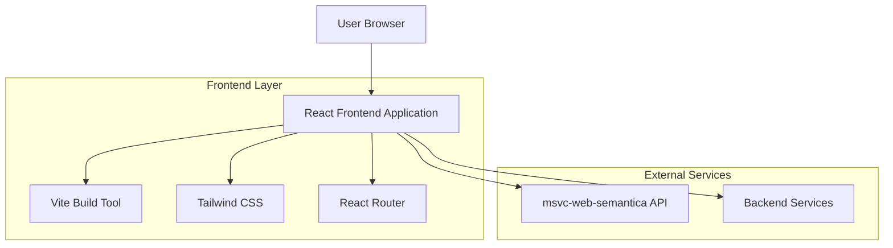
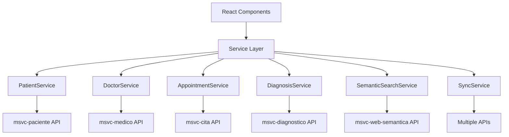

## 1. Architecture design



## 2. Technology Description
- Frontend: React@18 + tailwindcss@3 + vite
- Initialization Tool: vite-init
- Backend: None (frontend-only application)
- API Integration: Conexión directa con msvc-web-semantica en puerto 8084

## 3. Route definitions
| Route | Purpose |
|-------|---------|
| / | Dashboard principal con tarjetas de resumen y visualizaciones |
| /chatbot | Interfaz del chatbot de búsqueda semántica |
| /sync | Panel de sincronización de datos |
| /pacientes | Gestión de pacientes - listado y búsqueda |
| /pacientes/nuevo | Formulario de registro de nuevo paciente |
| /pacientes/:id | Detalles y edición de paciente |
| /pacientes/:id/historial | Historial médico del paciente |
| /medicos | Gestión de médicos - listado y búsqueda |
| /medicos/nuevo | Formulario de registro de nuevo médico |
| /medicos/:id | Detalles y edición de médico |
| /medicos/:id/agenda | Agenda de citas del médico |
| /citas | Gestión de citas - listado y filtros |
| /citas/nueva | Programar nueva cita |
| /citas/:id | Detalles y edición de cita |
| /diagnosticos | Gestión de diagnósticos - listado |
| /diagnosticos/nuevo | Crear nuevo diagnóstico |
| /diagnosticos/:id | Detalles y edición de diagnóstico |
| /diagnosticos/paciente/:id | Diagnósticos por paciente |
| /diagnosticos/cita/:id | Diagnósticos por cita |

## 4. API definitions

### 4.1 Semantic Search API
```
POST http://localhost:8084/api/semantic-search
```

Request:
| Param Name| Param Type  | isRequired  | Description |
|-----------|-------------|-------------|-------------|
| query     | string      | true        | Consulta médica en lenguaje natural |
| context   | string      | false       | Contexto adicional de la búsqueda |
| limit     | number      | false       | Número máximo de resultados (default: 10) |

Response:
| Param Name| Param Type  | Description |
|-----------|-------------|-------------|
| results   | array       | Array de resultados de búsqueda |
| confidence| number      | Nivel de confianza de los resultados |
| timestamp | string      | Timestamp de la búsqueda |

Example
```json
{
  "query": "síntomas de diabetes tipo 2",
  "context": "paciente adulto mayor",
  "limit": 5
}
```

### 4.2 Data Sync API
```
POST http://localhost:8084/api/sync
```

Request:
| Param Name| Param Type  | isRequired  | Description |
|-----------|-------------|-------------|-------------|
| syncType  | string      | true        | Tipo de sincronización ('full' o 'incremental') |
| force     | boolean     | false       | Forzar sincronización ignorando cache |

Response:
| Param Name| Param Type  | Description |
|-----------|-------------|-------------|
| status    | string      | Estado de la sincronización |
| syncedRecords| number   | Número de registros sincronizados |
| duration  | number      | Tiempo de sincronización en ms |

### 4.3 Pacientes API (msvc-paciente)

**Listar todos los pacientes**
```
GET http://localhost:8081/pacientes
```

**Obtener paciente por ID**
```
GET http://localhost:8081/pacientes/{id}
```

**Obtener paciente por usuario ID**
```
GET http://localhost:8081/pacientes/usuario/{usuarioId}
```

**Crear paciente**
```
POST http://localhost:8081/pacientes
```

Request:
| Param Name| Param Type  | isRequired  | Description |
|-----------|-------------|-------------|-------------|
| dni       | string      | true        | DNI del paciente (8 dígitos) |
| nombres   | string      | true        | Nombres del paciente |
| apellidos | string      | true        | Apellidos del paciente |
| telefono  | string      | true        | Teléfono (9 dígitos) |
| email     | string      | true        | Email válido |
| direccion | string      | true        | Dirección del paciente |
| fechaNacimiento | date | true   | Fecha de nacimiento |
| genero    | string      | true        | Género del paciente |
| estado    | string      | true        | Estado del paciente |
| usuarioId | number      | true        | ID del usuario asociado |

**Actualizar paciente**
```
PUT http://localhost:8081/pacientes/{id}
```

**Eliminar paciente**
```
DELETE http://localhost:8081/pacientes/{id}
```

**Eliminar paciente permanentemente (ADMIN)**
```
DELETE http://localhost:8081/pacientes/{id}/force
```

**Obtener citas del paciente**
```
GET http://localhost:8081/pacientes/{id}/citas
```

**Obtener historial médico del paciente**
```
GET http://localhost:8081/pacientes/{id}/historial-medico
```

**Agendar cita como paciente**
```
POST http://localhost:8081/pacientes/agendar-cita
```

**Cambiar estado de cita**
```
PATCH http://localhost:8081/pacientes/{pacienteId}/citas/{citaId}/estado
```

### 4.4 Médicos API (msvc-medico)

**Listar todos los médicos**
```
GET http://localhost:8082/medicos
```

**Obtener médico por ID**
```
GET http://localhost:8082/medicos/{id}
```

**Obtener médico por usuario ID**
```
GET http://localhost:8082/medicos/usuario/{usuarioId}
```

**Crear médico**
```
POST http://localhost:8082/medicos
```

Request:
| Param Name| Param Type  | isRequired  | Description |
|-----------|-------------|-------------|-------------|
| dni       | string      | true        | DNI del médico |
| nombres   | string      | true        | Nombres del médico |
| apellidos | string      | true        | Apellidos del médico |
| email     | string      | true        | Email válido |
| especialidad | string   | true        | Especialidad médica |
| estado    | string      | true        | Estado del médico |
| usuarioId | number      | true        | ID del usuario asociado |

**Actualizar médico**
```
PUT http://localhost:8082/medicos/{id}
```

**Eliminar médico**
```
DELETE http://localhost:8082/medicos/{id}
```

**Eliminar médico permanentemente (ADMIN)**
```
DELETE http://localhost:8082/medicos/{id}/force
```

**Obtener citas del médico**
```
GET http://localhost:8082/medicos/{id}/citas
```

**Agendar cita (ADMIN, RECEPCIONIST)**
```
POST http://localhost:8082/medicos/agendar-cita
```

**Registrar diagnóstico (DOCTOR, ADMIN)**
```
POST http://localhost:8082/medicos/registrar-diagnostico
```

### 4.5 Citas API (msvc-cita)

**Listar todas las citas**
```
GET http://localhost:8083/citas
```

**Obtener cita por ID**
```
GET http://localhost:8083/citas/{id}
```

**Obtener cita con detalles**
```
GET http://localhost:8083/citas/con-detalle/{id}
```

**Listar citas por paciente**
```
GET http://localhost:8083/citas/paciente/{id}
```

**Listar citas por médico**
```
GET http://localhost:8083/citas/medico/{id}
```

**Crear cita**
```
POST http://localhost:8083/citas
```

Request:
| Param Name| Param Type  | isRequired  | Description |
|-----------|-------------|-------------|-------------|
| fechaCita | date        | true        | Fecha de la cita |
| horaInicio | time       | true        | Hora de inicio |
| horaFin   | time        | true        | Hora de fin |
| motivo    | string      | true        | Motivo de la cita |
| estado    | string      | true        | Estado inicial |
| pacienteId | number     | true        | ID del paciente |
| medicoId  | number      | true        | ID del médico |

**Actualizar cita**
```
PUT http://localhost:8083/citas/{id}
```

**Eliminar cita**
```
DELETE http://localhost:8083/citas/{id}
```

**Eliminar cita permanentemente (ADMIN)**
```
DELETE http://localhost:8083/citas/{id}/force
```

**Cambiar estado de cita**
```
PATCH http://localhost:8083/citas/{id}/estado
```

Request:
| Param Name| Param Type  | isRequired  | Description |
|-----------|-------------|-------------|-------------|
| estado    | string      | true        | Nuevo estado de la cita |

### 4.6 Diagnósticos API (msvc-diagnostico)

**Listar todos los diagnósticos**
```
GET http://localhost:8085/diagnosticos
```

**Obtener diagnóstico por ID**
```
GET http://localhost:8085/diagnosticos/{id}
```

**Obtener diagnóstico con detalles**
```
GET http://localhost:8085/diagnosticos/con-detalle/{id}
```

**Listar diagnósticos por cita**
```
GET http://localhost:8085/diagnosticos/cita/{id}
```

**Listar diagnósticos por paciente**
```
GET http://localhost:8085/diagnosticos/paciente/{id}
```

**Crear diagnóstico**
```
POST http://localhost:8085/diagnosticos
```

Request:
| Param Name| Param Type  | isRequired  | Description |
|-----------|-------------|-------------|-------------|
| descripcion | string    | true        | Descripción del diagnóstico |
| tipo      | string      | true        | Tipo de diagnóstico |
| fechaDiagnostico | date | true       | Fecha del diagnóstico |
| citaId    | number      | true        | ID de la cita asociada |
| pacienteId | number     | true        | ID del paciente |

**Actualizar diagnóstico**
```
PUT http://localhost:8085/diagnosticos/{id}
```

**Eliminar diagnóstico**
```
DELETE http://localhost:8085/diagnosticos/{id}
```

**Eliminar diagnóstico permanentemente (ADMIN)**
```
DELETE http://localhost:8085/diagnosticos/{id}/force
```

## 5. Component Architecture

```mermaid
graph TD
  A[App] --> B[Layout]
  B --> C[Dashboard]
  B --> D[Chatbot]
  B --> E[SyncPanel]
  B --> F[PatientManagement]
  B --> G[DoctorManagement]
  B --> H[AppointmentManagement]
  B --> I[DiagnosisManagement]
  
  C --> J[SummaryCards]
  C --> K[DataVisualization]
  C --> L[NotificationPanel]
  
  D --> M[ChatInterface]
  D --> N[SearchResults]
  D --> O[FilterControls]
  
  E --> P[SyncControls]
  E --> Q[ActivityLogs]
  E --> R[SyncConfig]
  
  F --> S[PatientList]
  F --> T[PatientForm]
  F --> U[PatientDetails]
  F --> V[PatientHistory]
  
  G --> W[DoctorList]
  G --> X[DoctorForm]
  G --> Y[DoctorDetails]
  G --> Z[DoctorSchedule]
  
  H --> AA[AppointmentList]
  H --> AB[AppointmentForm]
  H --> AC[AppointmentDetails]
  H --> AD[StatusChanger]
  
  I --> AE[DiagnosisList]
  I --> AF[DiagnosisForm]
  I --> AG[DiagnosisDetails]
  I --> AH[PatientDiagnoses]
```



## 6. State Management

### 6.1 Global State (Context API)
- **DataContext**: Estado de datos del dashboard
- **ChatContext**: Historial de conversaciones del chatbot
- **SyncContext**: Estado de sincronización de datos
- **PatientContext**: Estado de gestión de pacientes
- **DoctorContext**: Estado de gestión de médicos
- **AppointmentContext**: Estado de gestión de citas
- **DiagnosisContext**: Estado de gestión de diagnósticos
- **AuthContext**: Estado de autenticación y roles de usuario

### 6.2 Local State (useState)
- Estados de UI (modales, loading states)
- Estados de formularios
- Estados de filtros y búsqueda

## 7. Key Dependencies
```json
{
  "dependencies": {
    "react": "^18.2.0",
    "react-dom": "^18.2.0",
    "react-router-dom": "^6.8.0",
    "axios": "^1.3.0",
    "lucide-react": "^0.321.0",
    "react-hook-form": "^7.43.0",
    "react-query": "^3.39.0",
    "date-fns": "^2.29.0",
    "react-datepicker": "^4.10.0",
    "react-select": "^5.7.0",
    "react-table": "^7.8.0",
    "react-hot-toast": "^2.4.0"
  },
  "devDependencies": {
    "@vitejs/plugin-react": "^3.1.0",
    "vite": "^4.1.0",
    "tailwindcss": "^3.2.0",
    "autoprefixer": "^10.4.0",
    "postcss": "^8.4.0",
    "@types/react": "^18.0.0",
    "@types/react-dom": "^18.0.0",
    "@types/react-datepicker": "^4.10.0"
  }
}
```

## 8. Build Configuration
- **Vite**: Configuración optimizada para desarrollo rápido
- **Tailwind**: Configuración personalizada con paleta de colores médicos
- **Environment Variables**: 
  - `VITE_API_URL_PACIENTE`: URL del servicio msvc-paciente (default: http://localhost:8081)
  - `VITE_API_URL_MEDICO`: URL del servicio msvc-medico (default: http://localhost:8082)
  - `VITE_API_URL_CITA`: URL del servicio msvc-cita (default: http://localhost:8083)
  - `VITE_API_URL_DIAGNOSTICO`: URL del servicio msvc-diagnostico (default: http://localhost:8085)
  - `VITE_API_URL_WEB_SEMANTICA`: URL del servicio msvc-web-semantica (default: http://localhost:8084)
  - `VITE_API_PORT`: Puerto del servicio principal (default: 8084)
  - `VITE_APP_NAME`: Nombre de la aplicación

## 9. Service Layer Architecture



## 10. Performance Considerations
- Lazy loading de componentes pesados
- Debouncing en búsquedas del chatbot
- Cache local para resultados de búsqueda frecuentes
- Optimización de imágenes y assets estáticos
- React Query para cache y sincronización de datos
- Paginación del lado del servidor para listados grandes
- Optimistic updates para mejorar UX en operaciones CRUD