## 1. Product Overview
Frontend de NOVA es la interfaz de usuario para el sistema de atención médica inteligente. Proporciona un dashboard interactivo con visualización de datos, un chatbot de búsqueda semántica para consultas médicas, y sincronización de datos en tiempo real.

Esta aplicación permite a los profesionales de la salud acceder rápidamente a información médica relevante, monitorear métricas clave y realizar búsquedas inteligentes de información clínica.

## 2. Core Features

### 2.1 User Roles
No se requiere autenticación. La aplicación es de acceso público y abierto para todos los usuarios.

### 2.2 Feature Module
Nuestro frontend de NOVA consiste en las siguientes páginas principales:
1. **Dashboard**: tarjetas de resumen, métricas clave, visualizaciones de datos.
2. **Chatbot de Búsqueda Semántica**: interfaz de conversación, resultados de búsqueda, historial de consultas.
3. **Panel de Sincronización**: control de sincronización de datos, estado de conexión, logs de actividad.
4. **Gestión de Pacientes**: listado, registro, edición, eliminación y visualización de pacientes.
5. **Gestión de Médicos**: listado, registro, edición, eliminación y visualización de médicos.
6. **Gestión de Citas**: listado, programación, edición, cancelación y cambio de estado de citas.
7. **Gestión de Diagnósticos**: listado, registro, edición, eliminación y visualización de diagnósticos.

### 2.3 Page Details
| Page Name | Module Name | Feature description |
|-----------|-------------|---------------------|
| Dashboard | Tarjetas de Resumen | Mostrar métricas clave como pacientes atendidos, consultas realizadas, tiempo promedio de respuesta |
| Dashboard | Visualizaciones de Datos | Presentar gráficos interactivos de tendencias médicas, distribución de casos por especialidad |
| Dashboard | Panel de Notificaciones | Mostrar alertas importantes, recordatorios de citas, mensajes del sistema |
| Chatbot de Búsqueda Semántica | Interfaz de Conversación | Permitir entrada de texto natural, mostrar respuestas del chatbot, mantener historial de conversación |
| Chatbot de Búsqueda Semántica | Resultados de Búsqueda | Mostrar resultados relevantes de búsqueda médica con fuentes y confianza |
| Chatbot de Búsqueda Semántica | Filtros Avanzados | Permitir filtrar por especialidad médica, fecha, tipo de información |
| Panel de Sincronización | Control de Sincronización | Iniciar/detener sincronización manual, verificar estado de conexión con backend |
| Panel de Sincronización | Logs de Actividad | Mostrar historial de sincronizaciones, errores, tiempo de última sincronización |
| Panel de Sincronización | Configuración de Frecuencia | Permitir ajustar intervalos de sincronización automática |
| Gestión de Pacientes | Listado de Pacientes | Mostrar tabla paginada con todos los pacientes, opciones de búsqueda y filtros |
| Gestión de Pacientes | Formulario de Registro | Crear nuevo paciente con validación de DNI, teléfono, email únicos |
| Gestión de Pacientes | Edición de Pacientes | Modificar datos del paciente con validaciones de formato |
| Gestión de Pacientes | Eliminar Pacientes | Soft delete con confirmación, force delete para ADMIN |
| Gestión de Pacientes | Ver Detalles | Mostrar información completa del paciente, citas y historial médico |
| Gestión de Pacientes | Agendar Cita | Permitir al paciente agendar citas médicas |
| Gestión de Pacientes | Ver Historial Médico | Mostrar historial clínico del paciente |
| Gestión de Médicos | Listado de Médicos | Mostrar tabla paginada con todos los médicos y especialidades |
| Gestión de Médicos | Formulario de Registro | Crear nuevo médico con validación de datos |
| Gestión de Médicos | Edición de Médicos | Modificar datos del médico incluyendo especialidad y estado |
| Gestión de Médicos | Eliminar Médicos | Soft delete con confirmación, force delete para ADMIN |
| Gestión de Médicos | Ver Agenda | Mostrar citas programadas del médico |
| Gestión de Médicos | Registrar Diagnóstico | Permitir al médico registrar diagnósticos tras la cita |
| Gestión de Médicos | Agendar Cita | Permitir agendar citas para el médico |
| Gestión de Citas | Listado de Citas | Mostrar tabla con todas las citas, filtros por fecha y estado |
| Gestión de Citas | Programar Cita | Crear nueva cita validando disponibilidad y evitando solapes |
| Gestión de Citas | Editar Cita | Modificar fecha, hora, médico o paciente de la cita |
| Gestión de Citas | Cancelar Cita | Cambiar estado a CANCELADA con validaciones de rol |
| Gestión de Citas | Cambiar Estado | Permitir transiciones de estado según rol (PROGRAMADA→REALIZADA) |
| Gestión de Citas | Ver Detalles | Mostrar información completa de la cita con paciente y médico |
| Gestión de Diagnósticos | Listado de Diagnósticos | Mostrar tabla con todos los diagnósticos médicos |
| Gestión de Diagnósticos | Crear Diagnóstico | Registrar nuevo diagnóstico asociado a cita y paciente |
| Gestión de Diagnósticos | Editar Diagnóstico | Modificar descripción y tipo de diagnóstico |
| Gestión de Diagnósticos | Eliminar Diagnóstico | Soft delete con confirmación, force delete para ADMIN |
| Gestión de Diagnósticos | Ver Detalles | Mostrar información completa del diagnóstico |
| Gestión de Diagnósticos | Ver por Cita | Mostrar diagnósticos asociados a una cita específica |
| Gestión de Diagnósticos | Ver por Paciente | Mostrar historial de diagnósticos de un paciente |

## 3. Core Process
**Flujo de Gestión Administrativa**: Los usuarios con rol ADMIN pueden acceder a todos los módulos de gestión para administrar pacientes, médicos, citas y diagnósticos. Pueden realizar operaciones CRUD completas en todas las entidades.

**Flujo de Gestión de Pacientes**: Los pacientes pueden ver y editar su propia información, agendar citas, cancelar sus propias citas, y ver su historial médico.

**Flujo de Gestión de Médicos**: Los médicos pueden ver su agenda de citas, registrar diagnósticos después de las consultas, y actualizar su información profesional.

**Flujo de Gestión de Recepcionistas**: Los recepcionistas pueden gestionar citas (programar, editar, cancelar) y administrar información de pacientes, pero no pueden marcar citas como realizadas ni registrar diagnósticos.

```mermaid
graph TD
  A[Dashboard] --> B[Chatbot de Búsqueda]
  A --> C[Panel de Sincronización]
  A --> D[Gestión de Pacientes]
  A --> E[Gestión de Médicos]
  A --> F[Gestión de Citas]
  A --> G[Gestión de Diagnósticos]
  
  D --> H[Listado Pacientes]
  D --> I[Formulario Paciente]
  D --> J[Detalles Paciente]
  D --> K[Historial Médico]
  
  E --> L[Listado Médicos]
  E --> M[Formulario Médico]
  E --> N[Agenda Médica]
  E --> O[Registrar Diagnóstico]
  
  F --> P[Listado Citas]
  F --> Q[Programar Cita]
  F --> R[Editar Cita]
  F --> S[Cambiar Estado]
  
  G --> T[Listado Diagnósticos]
  G --> U[Crear Diagnóstico]
  G --> V[Editar Diagnóstico]
  G --> W[Diagnósticos por Paciente]
  
  B --> X[Resultados de Búsqueda]
  C --> Y[Configuración de Sincronización]
  X --> B
  Y --> C
```

## 4. User Interface Design

### 4.1 Design Style
- **Colores Primarios**: Azul médico (#2563EB) con acentos en verde salud (#10B981)
- **Colores Secundarios**: Grises neutros (#6B7280, #9CA3AF) para fondos y texto
- **Estilo de Botones**: Botones redondeados con sombras sutiles, efectos hover suaves
- **Tipografía**: Inter para encabezados, Roboto para contenido principal
- **Tamaños de Fuente**: 16px base, 24px para títulos, 14px para textos secundarios
- **Estilo de Layout**: Diseño basado en tarjetas con navegación lateral, espaciado consistente
- **Iconos**: Estilo lineal minimalista, consistente en todo el sistema

### 4.2 Page Design Overview
| Page Name | Module Name | UI Elements |
|-----------|-------------|-------------|
| Dashboard | Tarjetas de Resumen | Tarjetas con bordes redondeados, gradientes sutiles, iconos representativos, números grandes y claros |
| Dashboard | Visualizaciones de Datos | Gráficos de líneas y barras interactivos, paleta de colores coherente, leyendas claras |
| Chatbot de Búsqueda Semántica | Interfaz de Conversación | Chat estilo burbuja con avatar del bot, entrada de texto prominente, botón de envío destacado |
| Panel de Sincronización | Control de Sincronización | Interruptor toggle moderno, indicador de estado con colores (verde/rojo), botón de acción principal |

### 4.3 Responsiveness
Diseño desktop-first con adaptación completa a tablets y móviles. Breakpoints en 768px y 1024px. El dashboard se reorganiza en columnas apiladas en móvil. El chatbot mantiene funcionalidad completa en todos los dispositivos con entrada de texto optimizada para touch.