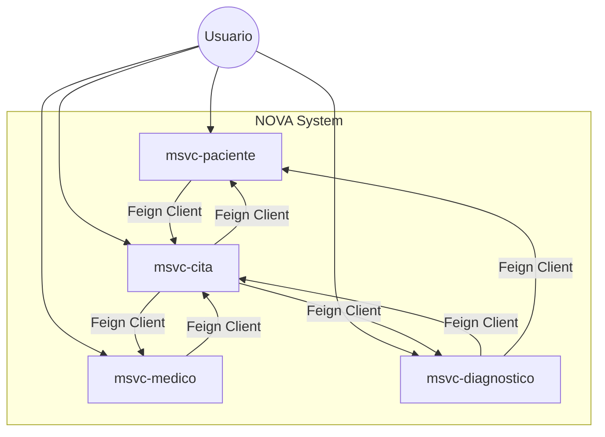

# NOVA_ing-AtencionMedica - Arquitectura de Microservicios

Este proyecto implementa una arquitectura de microservicios para la gestión de atención médica, integrando servicios de Pacientes, Médicos, Citas, Diagnósticos y Web Semántica.

## 1. Arquitectura y Diseño

### Estructura de Microservicios
El sistema está dividido en dominios funcionales claros, cada uno con su propia base de datos y responsabilidad única:

*   **msvc-paciente**: Gestiona la información de los pacientes.
*   **msvc-medico**: Gestiona la información de los médicos, incluyendo sus especialidades.
*   **msvc-cita**: Núcleo de la operación, gestiona el agendamiento y coordina la relación entre médicos y pacientes.
*   **msvc-diagnostico**: Gestiona los resultados y diagnósticos derivados de las citas médicas.
*   **msvc-web-semantica**: Expone vistas semánticas (RDF/OWL) y consultas SPARQL sobre los datos clínicos.

### Relaciones y Comunicación (Refactorización)

Se ha implementado un patrón de comunicación **bidireccional síncrona** utilizando **OpenFeign** (Spring Cloud OpenFeign), basándose en los patrones observados en el proyecto de referencia `proyecto-integracion`. Esto permite mantener la integridad referencial lógica y enriquecer las respuestas de la API sin acoplar las bases de datos.

#### Diagrama de Relaciones Lógicas



### Justificación de Decisiones de Diseño

1.  **Comunicación con Feign Clients**: Se eligió Feign sobre RestTemplate o WebClient por su naturaleza declarativa y facilidad de integración con Spring Boot, como se observa en `proyecto-integracion`. Esto simplifica el código y mejora la legibilidad.
    
2.  **Uso de DTOs (Data Transfer Objects)**: Para evitar exponer las entidades JPA directamente y desacoplar el modelo de dominio interno de la API pública, se crearon DTOs específicos (ej. `CitaDetalle`, `DiagnosticoDetalle`) en cada microservicio que consume datos de otros. Esto previene ciclos de dependencia en la serialización JSON y permite moldear la respuesta según la necesidad del cliente.

3.  **Relaciones Bidireccionales**:
    *   **Cita -> Paciente/Medico**: Una cita necesita mostrar detalles completos del paciente y médico, no solo sus IDs.
    *   **Paciente/Medico -> Cita**: Es fundamental para el historial médico poder consultar "todas las citas de un paciente" o "todas las citas de un médico" desde sus respectivos servicios.
    *   **Diagnostico -> Cita/Paciente**: Un diagnóstico está intrínsecamente ligado a una cita y pertenece a un paciente.
4.  **Capa de Web Semántica**:
    *   **msvc-web-semantica** construye grafos RDF/OWL a partir de los MSVC de dominio y expone endpoints especializados (por ejemplo, JSON-LD y consultas SPARQL) para evidenciar el uso de Web Semántica.

## 2. Implementación Técnica

### Tecnologías Clave
*   **Java 25**
*   **Spring Boot 3.5.9**
*   **Spring Cloud 2025.0.1** (OpenFeign)
*   **PostgreSQL / MySQL** (Drivers)
*   **Lombok**
*   **Apache Jena** (RDF, SPARQL)
*   **OWL API** (Ontologías OWL)

### Endpoints Principales y Flujos

#### msvc-cita
*   `GET /citas/con-detalle/{id}`: Obtiene una cita y enriquece la respuesta consultando a `msvc-paciente`, `msvc-medico` y `msvc-diagnostico`.
*   `GET /citas/paciente/{id}`: Usado por `msvc-paciente` para obtener historial.
*   `GET /citas/medico/{id}`: Usado por `msvc-medico` para obtener agenda.

#### msvc-paciente
*   `GET /pacientes/{id}/citas`: Consulta a `msvc-cita` para devolver el paciente junto con su historial de citas.

#### msvc-medico
*   `GET /medicos/{id}/citas`: Consulta a `msvc-cita` para devolver el médico junto con sus citas programadas.

#### msvc-diagnostico
*   `GET /diagnosticos/con-detalle/{id}`: Obtiene el diagnóstico y recupera la información de la cita y el paciente asociados.

## 3. Ejecución

Para ejecutar el proyecto, asegúrese de tener configuradas las bases de datos (o usar H2/Docker si aplica) y ejecute cada microservicio:

```bash
# En terminales separadas
cd msvc-paciente && ./mvnw spring-boot:run
cd msvc-medico && ./mvnw spring-boot:run
cd msvc-cita && ./mvnw spring-boot:run
cd msvc-diagnostico && ./mvnw spring-boot:run
cd msvc-web-semantica && ./mvnw spring-boot:run
```

> Nota: esta versión del proyecto no implementa autenticación ni autorización; todos los endpoints están abiertos con fines académicos para centrarse en la integración de microservicios y Web Semántica.

## 4. Pruebas y Verificación

Se han incluido pruebas de integración básicas para verificar la carga del contexto de Spring y la configuración de los clientes Feign.

### Ejecución de Pruebas
Para ejecutar las pruebas en un microservicio específico (ej. `msvc-cita`):

```bash
./mvnw test -pl msvc-cita
```

Las pruebas utilizan una base de datos en memoria H2 para aislar el entorno y verificar la integridad de la configuración JPA y los beans de la aplicación sin dependencias externas.
