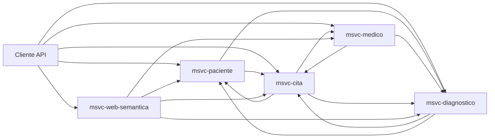

# Visión general del proyecto

NOVA es una plataforma backend basada en microservicios para atención médica.

Cubre el ciclo clínico básico y añade una capa semántica para consultas RDF, SPARQL y lenguaje natural.

### Qué resuelve

* Gestión de pacientes.
* Gestión de médicos y horarios.
* Agenda de citas con validación de solapes.
* Registro de diagnósticos.
* Exposición semántica de conocimiento clínico.

### Microservicios y puertos

* `msvc-medico` → `8080`
* `msvc-cita` → `8081`
* `msvc-diagnostico` → `8082`
* `msvc-paciente` → `8083`
* `msvc-web-semantica` → `8084`

### Rol de cada servicio

* `msvc-paciente` gestiona pacientes, sus citas y su historial médico.
* `msvc-medico` gestiona médicos, horarios, agenda y registro de diagnósticos.
* `msvc-cita` coordina el agendamiento y arma vistas enriquecidas de cita.
* `msvc-diagnostico` administra diagnósticos por cita y paciente.
* `msvc-web-semantica` transforma datos operacionales en grafos RDF.

### Vista lógica



### Tecnologías base

* Java `25`
* Spring Boot `3.5.9`
* Spring Cloud `2025.0.1`
* Spring Data JPA
* OpenFeign
* Lombok
* Apache Jena `5.6.0`
* OWL API `5.1.20`
* MySQL y PostgreSQL

### Estructura del repositorio

```
/
├─ pom.xml
├─ README.md
├─ documentacion/
├─ msvc-paciente/
├─ msvc-medico/
├─ msvc-cita/
├─ msvc-diagnostico/
└─ msvc-web-semantica/
```
