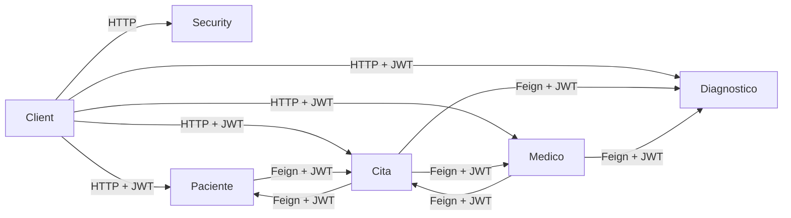
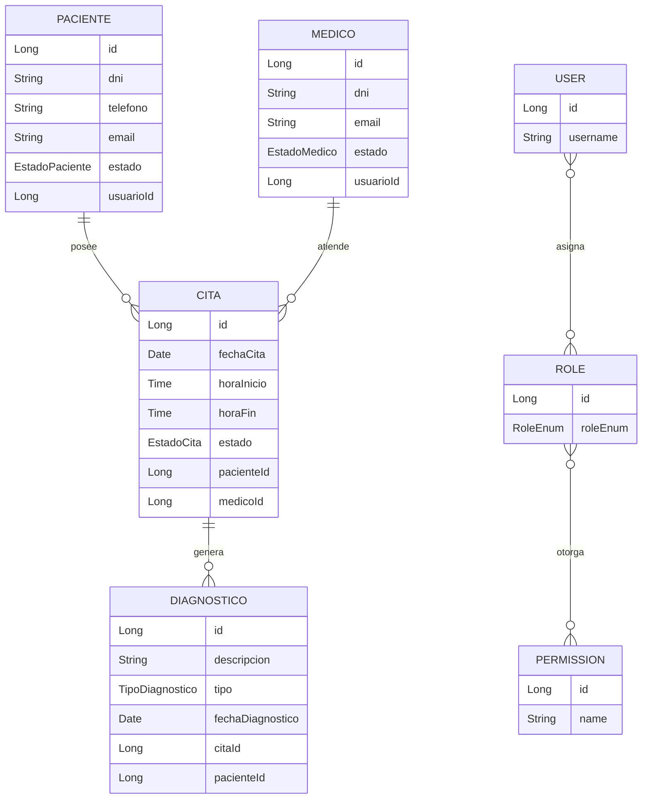
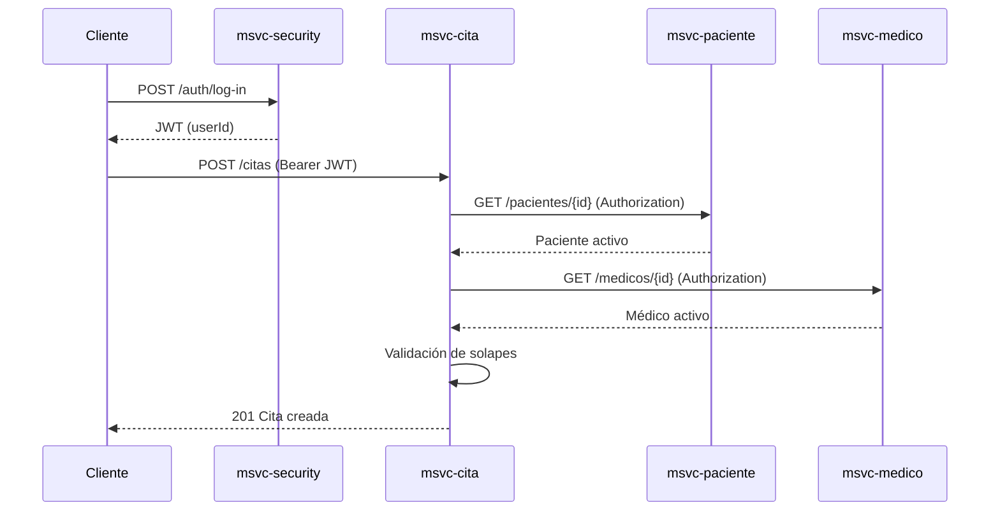
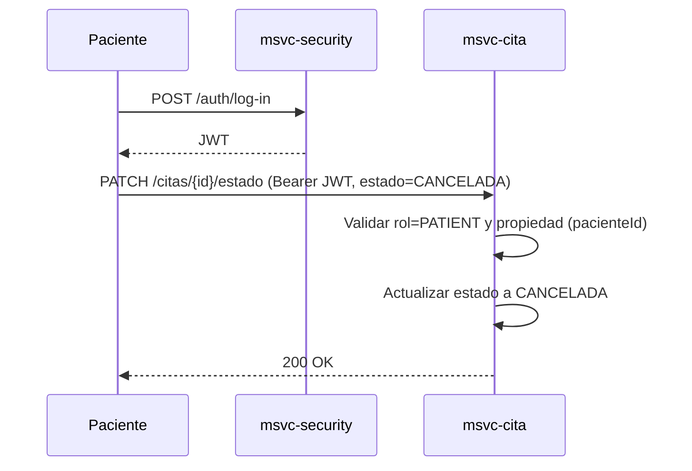
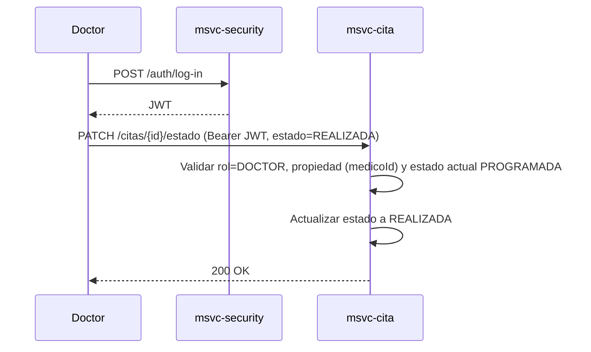
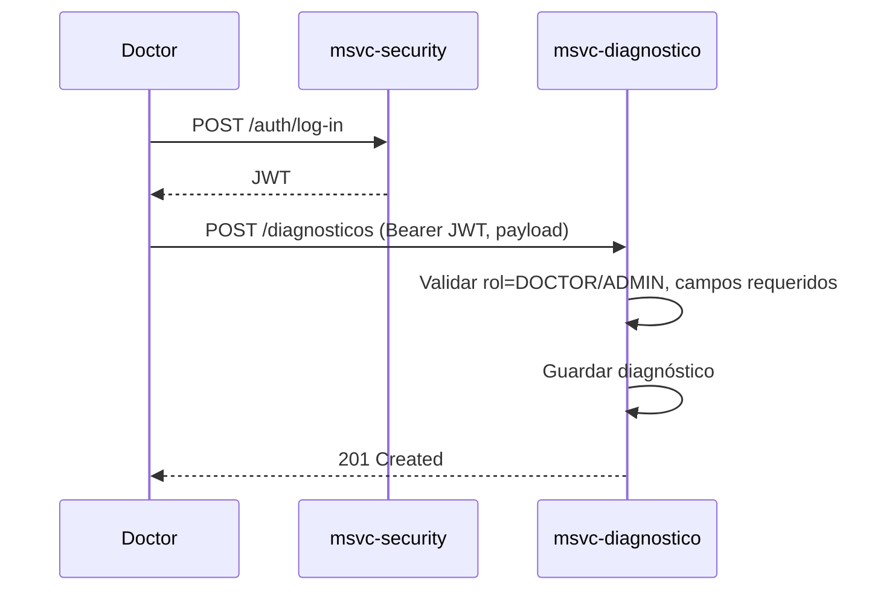
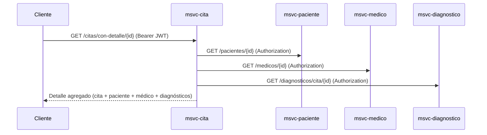
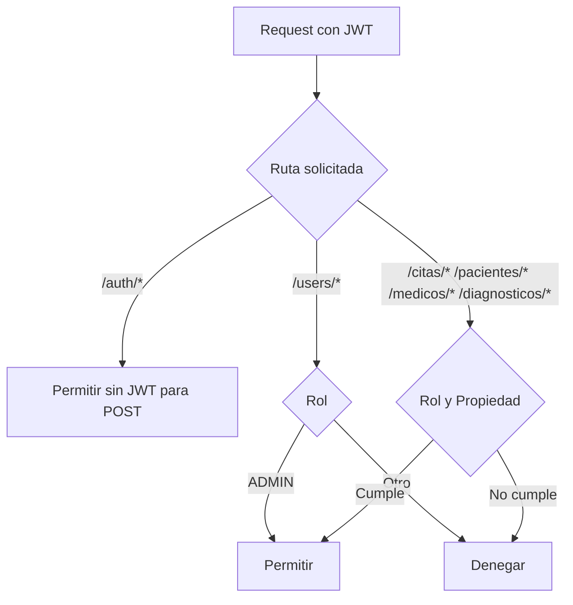
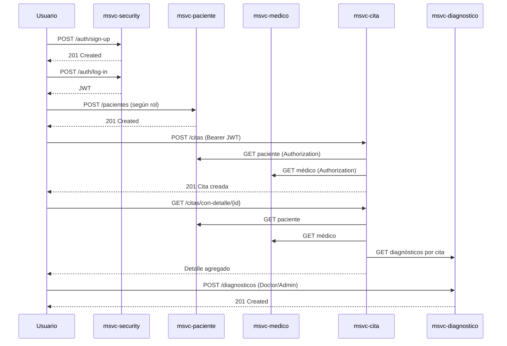
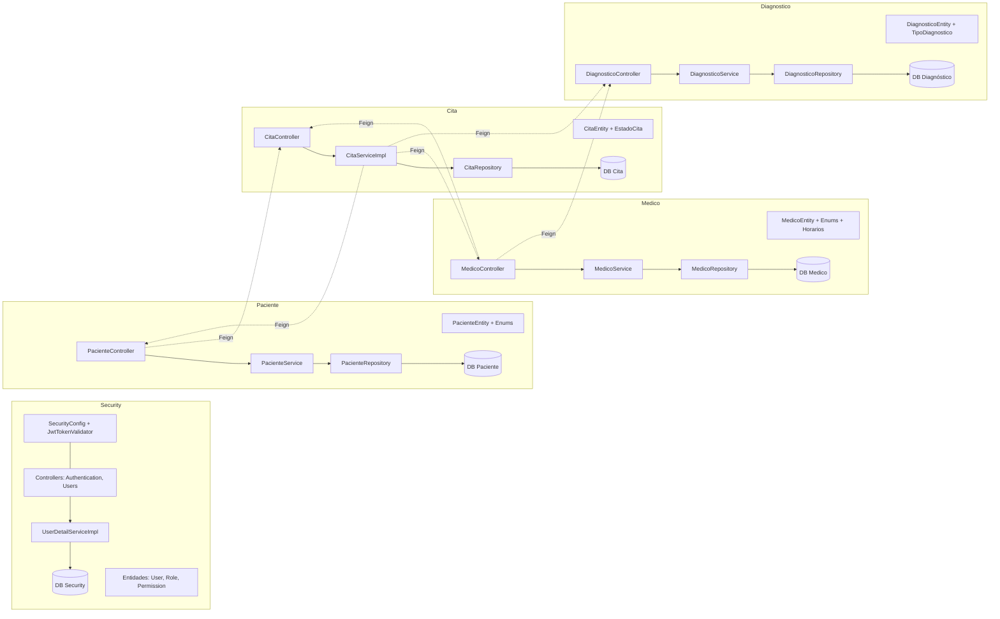

# Documentación General — NOVA Atención Médica (V.5)

## Arquitectura General
- Microservicios: msvc-security (auth y usuarios), msvc-paciente, msvc-medico, msvc-cita, msvc-diagnostico.
- Comunicación síncrona HTTP entre MSVCs usando OpenFeign con propagación del Authorization Header.
- Seguridad por JWT validado en cada MSVC; control de acceso por roles vía anotaciones en controladores.
- Persistencia con JPA/Hibernate por servicio; entidades y repositorios separados por dominio.
- Entradas principales:
  - Security: [AuthenticationController](file:///d:/IngSoftware3/NOVA_ing-AtencionMedica_V.5_End/msvc-security/src/main/java/org/nova/ing/springcloud/atencion/medica/msvc/seciruty/controllers/AuthenticationController.java), [UserController](file:///d:/IngSoftware3/NOVA_ing-AtencionMedica_V.5_End/msvc-security/src/main/java/org/nova/ing/springcloud/atencion/medica/msvc/seciruty/controllers/UserController.java)
  - Cita: [CitaController](file:///d:/IngSoftware3/NOVA_ing-AtencionMedica_V.5_End/msvc-cita/src/main/java/org/nova/ing/springcloud/atencion/medica/msvc/cita/controllers/CitaController.java)
  - Paciente: [PacienteController](file:///d:/IngSoftware3/NOVA_ing-AtencionMedica_V.5_End/msvc-paciente/src/main/java/org/nova/ing/springcloud/atencion/medica/msvc/paciente/controllers/PacienteController.java)
  - Medico: [MedicoController](file:///d:/IngSoftware3/NOVA_ing-AtencionMedica_V.5_End/msvc-medico/src/main/java/org/nova/ing/springcloud/atencion/medica/msvc/medico/controllers/MedicoController.java)
  - Diagnóstico: [DiagnosticoController](file:///d:/IngSoftware3/NOVA_ing-AtencionMedica_V.5_End/msvc-diagnostico/src/main/java/org/nova/ing/springcloud/atencion/medica/msvc/diagnostico/controllers/DiagnosticoController.java)

## Mapa de Arquitectura
- Front/Clientes -> Gateway (opcional) -> MSVCs
- Flujos clave:
  - Login en Security -> emisión JWT -> consumo de endpoints protegidos en otros MSVCs.
  - Feign intercepta y propaga Authorization hacia servicios llamados.
  - Control de reglas en controladores y servicios según rol y propiedad de recursos.



## Flujo de Autorización
- Login: POST /auth/log-in en Security retorna JWT con claim userId.
- Validación: filtro JwtTokenValidator en cada MSVC valida token y pobla el contexto de seguridad.
- Roles disponibles: ADMIN, DOCTOR, PATIENT, RECEPTIONIST ([RoleEnum](file:///d:/IngSoftware3/NOVA_ing-AtencionMedica_V.5_End/msvc-security/src/main/java/org/nova/ing/springcloud/atencion/medica/msvc/seciruty/enums/RoleEnum.java)).
- Propagación: FeignInterceptor copia Authorization a las llamadas internas para autorización en cascada.
- Autorización fina: @PreAuthorize en endpoints; reglas de negocio adicionales validan propiedad (ej. paciente solo accede a sus citas).

## Estado y Reglas de Negocio (Resumen)
- Cita:
  - Estados: PROGRAMADA, CANCELADA, REALIZADA.
  - Conflictos de horario evitados por repositorio (médico/paciente no se solapan).
  - Doctor activo y Paciente activo requeridos para crear cita.
  - Cambios de estado restringidos por rol (paciente solo cancela; doctor marca realizada bajo condiciones).
- Paciente:
  - Validaciones de DNI, teléfono, email únicos y formato.
  - Paciente solo ve su propio perfil y recursos relacionados.
- Medico:
  - Doctor solo accede a su perfil y citas, salvo ADMIN.
- Diagnóstico:
  - Propiedad por paciente/relación con cita.
  - Creación/edición solo por DOCTOR/ADMIN.
- Security:
  - Matriz User–Role–Permission con asociaciones M:N.

## Catálogo de Endpoints (Vista Global)
- Security:
  - POST /auth/sign-up
  - POST /auth/log-in
  - GET /auth/me
  - /users CRUD con delete permanente para ADMIN
- Paciente:
  - CRUD /pacientes
  - GET /pacientes/usuario/{usuarioId}
  - GET /pacientes/{id}/citas
  - POST /pacientes/agendar-cita
  - PATCH /pacientes/{pacienteId}/citas/{citaId}/estado
  - GET /pacientes/{id}/historial-medico
- Medico:
  - CRUD /medicos
  - GET /medicos/{id}/citas
  - POST /medicos/agendar-cita
  - POST /medicos/registrar-diagnostico
  - GET /medicos/usuario/{usuarioId}
- Cita:
  - CRUD /citas + DELETE /citas/{id}/force
  - GET /citas/con-detalle/{id}
  - GET /citas/paciente/{id}
  - GET /citas/medico/{id}
  - PATCH /citas/{id}/estado
- Diagnóstico:
  - CRUD /diagnosticos + DELETE /diagnosticos/{id}/force
  - GET /diagnosticos/con-detalle/{id}
  - GET /diagnosticos/cita/{id}
  - GET /diagnosticos/paciente/{id}

## Diagramas ER Simples


## Matriz de Roles y Permisos
- ADMIN:
  - Acceso total de lectura/escritura, puede eliminar permanente recursos.
  - Gestión de usuarios y roles.
- DOCTOR:
  - Lee pacientes/diagnósticos asociados; crea/edita diagnósticos; agenda citas; marca realizada con reglas.
- PATIENT:
  - Consulta su perfil, sus citas y diagnósticos; agenda sus citas; solo puede cancelar sus citas.
- RECEPTIONIST:
  - Lista pacientes y médicos; agenda citas; no marca realizadas; no accede a recursos sensibles fuera de alcance.

## Reglas de Validación (Claves)
- Paciente: formatos y unicidad de DNI/telefono/email; campos obligatorios ([PacienteEntity](file:///d:/IngSoftware3/NOVA_ing-AtencionMedica_V.5_End/msvc-paciente/src/main/java/org/nova/ing/springcloud/atencion/medica/msvc/paciente/models/entities/PacienteEntity.java#L20-L49)).
- Cita: fecha/hora obligatorias, estado requerido; solape evitado por queries de repositorio ([CitaRepository](file:///d:/IngSoftware3/NOVA_ing-AtencionMedica_V.5_End/msvc-cita/src/main/java/org/nova/ing/springcloud/atencion/medica/msvc/cita/repositories/CitaRepository.java#L18-L22)).
- Diagnóstico: tipo/fecha/paciente/cita obligatorios; activo por defecto.

## Diagrama de Secuencia (Caso Clave: Agendar Cita)


## Diagramas Adicionales
- Secuencia: Cambio de estado de cita por Paciente


- Secuencia: Cambio de estado de cita por Médico


- Secuencia: Registrar diagnóstico


- Secuencia: Ver detalle completo de cita


- Flujo: Autorización por roles


## Migraciones Futuras
- Indices compuestos en CITA (medicoId, fechaCita, horaInicio/horaFin) y (pacienteId, fechaCita, horaInicio/horaFin).
- Auditoría: campos createdAt/updatedAt y usuario actor.
- Normalizar horarios de médico a entidad propia y relaciones.
- Soft delete consistente (activo flags) y vistas filtradas.
- Externalizar configuración de URLs Feign a properties y perfiles.
- Agregar gateway/API-docs centralizadas (OpenAPI).

## Buenas Prácticas
- Validar propiedad y rol en controlador y/o servicio, mantener reglas del dominio cerca del caso de uso.
- Propagar Authorization en Feign; manejar fallos remotos con tolerancia (timeouts, circuit breaker).
- No exponer datos sensibles; sanitizar respuestas.
- Transacciones: delimitar en servicios; consultas readOnly.
- Versionar endpoints y contratos; pruebas de integración entre MSVCs.

## Onboarding para Nuevos
- Recorrido “Hello Flow”:
  1. Registrar usuario con rol en Security (POST /auth/sign-up).
  2. Login para obtener JWT (POST /auth/log-in).
  3. Crear Paciente/Medico según rol (POST /pacientes o /medicos) si aplica.
  4. Agendar una cita (POST /citas o /pacientes/agendar-cita).
  5. Ver detalle de cita con relaciones (GET /citas/con-detalle/{id}).
- Mapa de rutas útil:
  - Autenticación: /auth/*
  - Gestión: /users/*
  - Dominios: /pacientes/*, /medicos/*, /citas/*, /diagnosticos/*
- Glosario:
  - JWT: token firmado que porta identidad y roles.
  - Feign: cliente HTTP declarativo para llamadas entre MSVCs.
  - Propiedad: relación entre recurso y usuario/rol que lo autoriza.
  - Solape: intersección de rangos horarios que debe evitarse.

## Onboarding “Hello Flow” — Diagramas
- Actividad: Recorrido básico de un usuario nuevo
```mermaid
flowchart TD
  A[Sign-up en Security] --> B[Log-in y obtener JWT]
  B --> C{Rol asignado}
  C -->|PATIENT| D[Crear/validar Paciente]
  C -->|DOCTOR| E[Crear/validar Médico]
  D --> F[Agendar Cita]
  E --> F
  F --> G[Ver detalle de Cita con relaciones]
  G --> H[Registrar Diagnóstico (Doctor/Admin)]
```

- Secuencia: Recorrido end-to-end


## Mapa de Componentes por MSVC


## Diagrama de Despliegue
```mermaid
flowchart TD
  subgraph Cliente
    WEB[Web/Móvil/Cliente API]
  end

  subgraph Infraestructura
    GWT[API Gateway (opcional)]
    REG[Service Registry (opcional)]
  end

  subgraph Contenedores
    SEC[msvc-security]
    PAC[msvc-paciente]
    MED[msvc-medico]
    CIT[msvc-cita]
    DIA[msvc-diagnostico]
  end

  subgraph Bases de Datos
    SEC_DB[(DB Security)]
    PAC_DB[(DB Paciente)]
    MED_DB[(DB Medico)]
    CIT_DB[(DB Cita)]
    DIA_DB[(DB Diagnóstico)]
  end

  WEB --> GWT
  GWT --> SEC
  GWT --> PAC
  GWT --> MED
  GWT --> CIT
  GWT --> DIA

  SEC --> SEC_DB
  PAC --> PAC_DB
  MED --> MED_DB
  CIT --> CIT_DB
  DIA --> DIA_DB

  CIT -. JWT/Feign .-> PAC
  CIT -. JWT/Feign .-> MED
  CIT -. JWT/Feign .-> DIA
  MED -. JWT/Feign .-> CIT
  MED -. JWT/Feign .-> DIA
  PAC -. JWT/Feign .-> CIT
```


