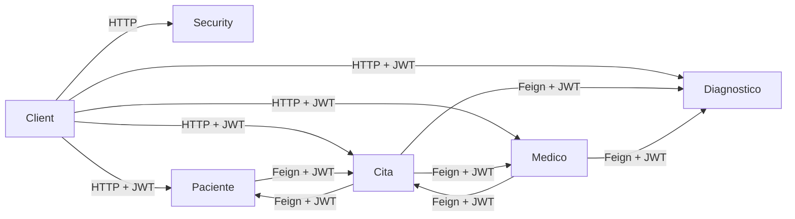
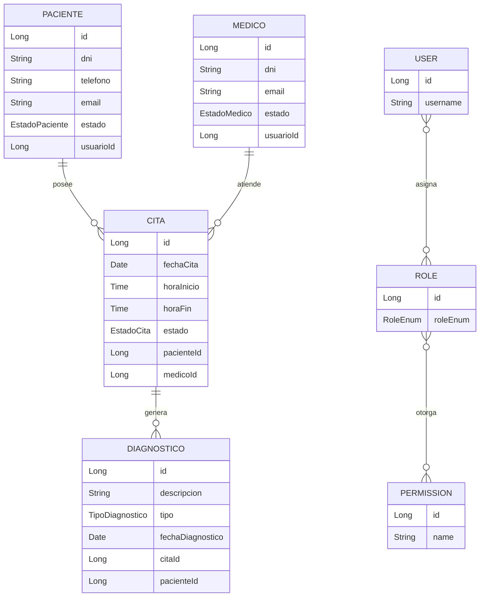
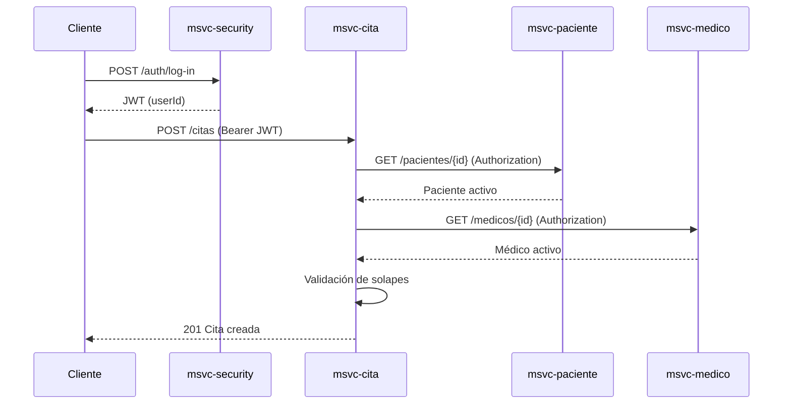
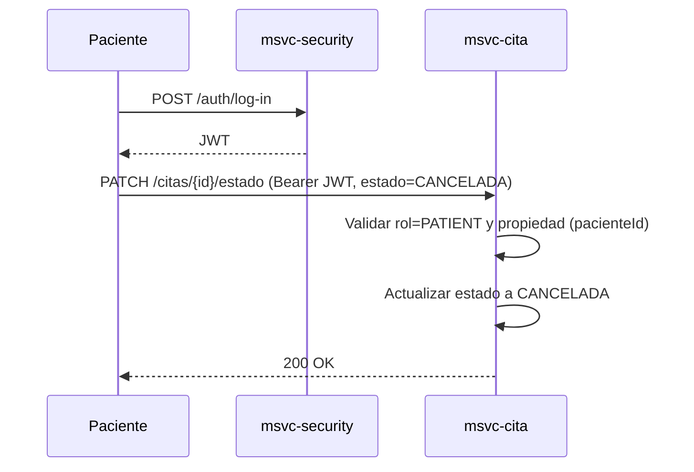
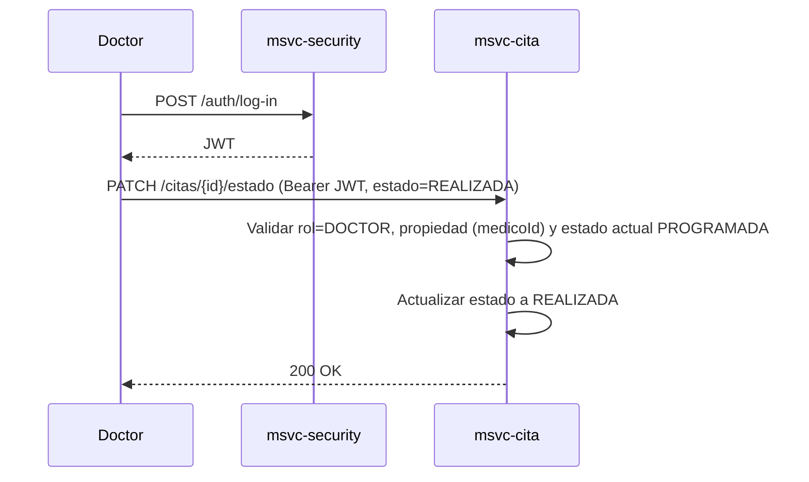
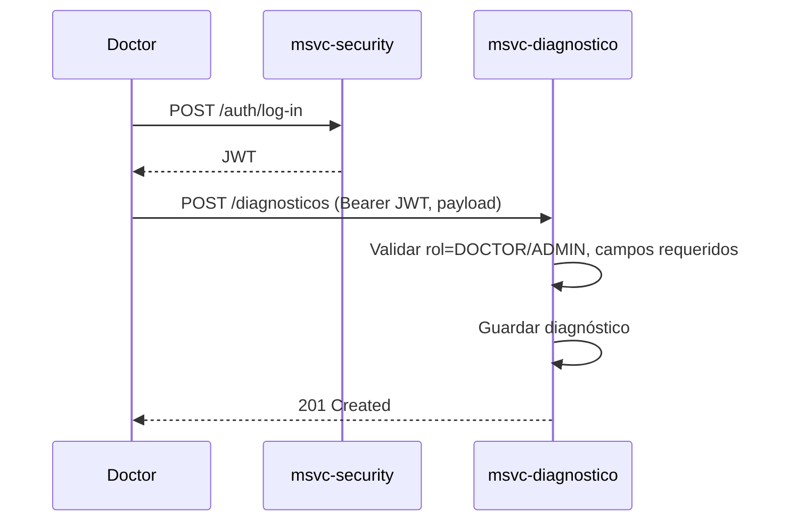
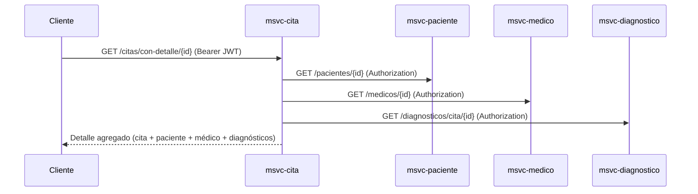
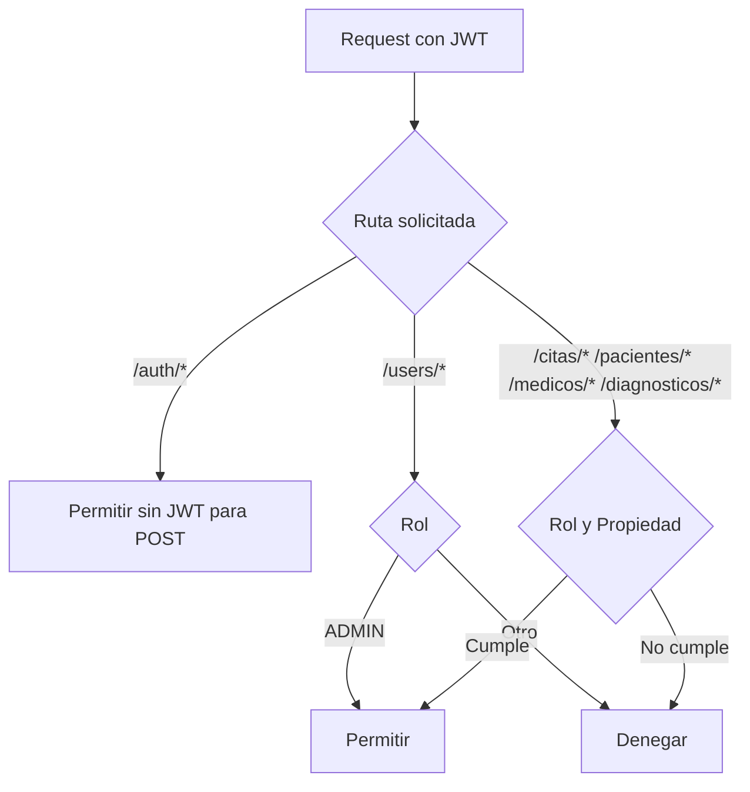
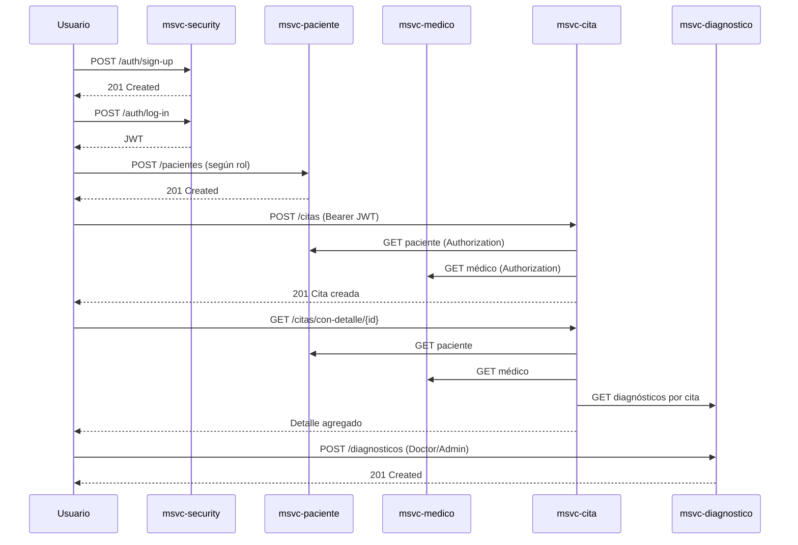
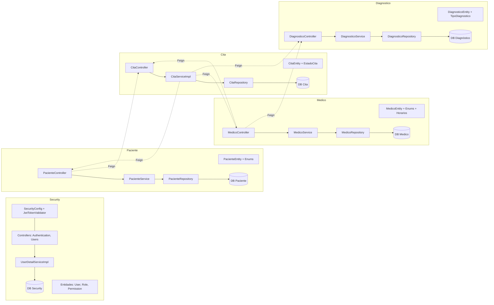

# Documentación General — NOVA Atención Médica (V.5)

> Nota de versión actual: el código ya no incluye `msvc-security` ni validación JWT; las secciones de seguridad y roles descritas aquí son históricas y no se aplican al despliegue actual, que se centra en integración de microservicios y Web Semántica.

## Arquitectura General
- Microservicios: msvc-security (auth y usuarios), msvc-paciente, msvc-medico, msvc-cita, msvc-diagnostico.
- Comunicación síncrona HTTP entre MSVCs usando OpenFeign con propagación del Authorization Header.
- Seguridad por JWT validado en cada MSVC; control de acceso por roles vía anotaciones en controladores.
- Persistencia con JPA/Hibernate por servicio; entidades y repositorios separados por dominio.
- Entradas principales:
  - Security: [AuthenticationController](file:///d:/IngSoftware3/NOVA_ing-AtencionMedica_V.5_End/msvc-security/src/main/java/org/nova/ing/springcloud/atencion/medica/msvc/seciruty/controllers/AuthenticationController.java), [UserController](file:///d:/IngSoftware3/NOVA_ing-AtencionMedica_V.5_End/msvc-security/src/main/java/org/nova/ing/springcloud/atencion/medica/msvc/seciruty/controllers/UserController.java)
  - Cita: [CitaController](file:///d:/IngSoftware3/NOVA_ing-AtencionMedica_V.5_End/msvc-cita/src/main/java/org/nova/ing/springcloud/atencion/medica/msvc/cita/controllers/CitaController.java)
  - Paciente: [PacienteController](file:///d:/IngSoftware3/NOVA_ing-AtencionMedica_V.5_End/msvc-paciente/src/main/java/org/nova/ing/springcloud/atencion/medica/msvc/paciente/controllers/PacienteController.java)
  - Medico: [MedicoController](file:///d:/IngSoftware3/NOVA_ing-AtencionMedica_V.5_End/msvc-medico/src/main/java/org/nova/ing/springcloud/atencion/medica/msvc/medico/controllers/MedicoController.java)
  - Diagnóstico: [DiagnosticoController](file:///d:/IngSoftware3/NOVA_ing-AtencionMedica_V.5_End/msvc-diagnostico/src/main/java/org/nova/ing/springcloud/atencion/medica/msvc/diagnostico/controllers/DiagnosticoController.java)

## Mapa de Arquitectura
- Front/Clientes -> Gateway (opcional) -> MSVCs
- Flujos clave:
  - Login en Security -> emisión JWT -> consumo de endpoints protegidos en otros MSVCs.
  - Feign intercepta y propaga Authorization hacia servicios llamados.
  - Control de reglas en controladores y servicios según rol y propiedad de recursos.



## Flujo de Autorización
- Login: POST /auth/log-in en Security retorna JWT con claim userId.
- Validación: filtro JwtTokenValidator en cada MSVC valida token y pobla el contexto de seguridad.
- Roles disponibles: ADMIN, DOCTOR, PATIENT, RECEPTIONIST ([RoleEnum](file:///d:/IngSoftware3/NOVA_ing-AtencionMedica_V.5_End/msvc-security/src/main/java/org/nova/ing/springcloud/atencion/medica/msvc/seciruty/enums/RoleEnum.java)).
- Propagación: FeignInterceptor copia Authorization a las llamadas internas para autorización en cascada.
- Autorización fina: @PreAuthorize en endpoints; reglas de negocio adicionales validan propiedad (ej. paciente solo accede a sus citas).

## Estado y Reglas de Negocio (Resumen)
- Cita:
  - Estados: PROGRAMADA, CANCELADA, REALIZADA.
  - Conflictos de horario evitados por repositorio (médico/paciente no se solapan).
  - Doctor activo y Paciente activo requeridos para crear cita.
  - Cambios de estado restringidos por rol (paciente solo cancela; doctor marca realizada bajo condiciones).
- Paciente:
  - Validaciones de DNI, teléfono, email únicos y formato.
  - Paciente solo ve su propio perfil y recursos relacionados.
- Medico:
  - Doctor solo accede a su perfil y citas, salvo ADMIN.
- Diagnóstico:
  - Propiedad por paciente/relación con cita.
  - Creación/edición solo por DOCTOR/ADMIN.
- Security:
  - Matriz User–Role–Permission con asociaciones M:N.

## Catálogo de Endpoints (Vista Global)
- Security:
  - POST /auth/sign-up
  - POST /auth/log-in
  - GET /auth/me
  - /users CRUD con delete permanente para ADMIN
- Paciente:
  - CRUD /pacientes
  - GET /pacientes/usuario/{usuarioId}
  - GET /pacientes/{id}/citas
  - POST /pacientes/agendar-cita
  - PATCH /pacientes/{pacienteId}/citas/{citaId}/estado
  - GET /pacientes/{id}/historial-medico
- Medico:
  - CRUD /medicos
  - GET /medicos/{id}/citas
  - POST /medicos/agendar-cita
  - POST /medicos/registrar-diagnostico
  - GET /medicos/usuario/{usuarioId}
- Cita:
  - CRUD /citas + DELETE /citas/{id}/force
  - GET /citas/con-detalle/{id}
  - GET /citas/paciente/{id}
  - GET /citas/medico/{id}
  - PATCH /citas/{id}/estado
- Diagnóstico:
  - CRUD /diagnosticos + DELETE /diagnosticos/{id}/force
  - GET /diagnosticos/con-detalle/{id}
  - GET /diagnosticos/cita/{id}
  - GET /diagnosticos/paciente/{id}

## Diagramas ER Simples


## Matriz de Roles y Permisos
- ADMIN:
  - Acceso total de lectura/escritura, puede eliminar permanente recursos.
  - Gestión de usuarios y roles.
- DOCTOR:
  - Lee pacientes/diagnósticos asociados; crea/edita diagnósticos; agenda citas; marca realizada con reglas.
- PATIENT:
  - Consulta su perfil, sus citas y diagnósticos; agenda sus citas; solo puede cancelar sus citas.
- RECEPTIONIST:
  - Lista pacientes y médicos; agenda citas; no marca realizadas; no accede a recursos sensibles fuera de alcance.

## Reglas de Validación (Claves)
- Paciente: formatos y unicidad de DNI/telefono/email; campos obligatorios ([PacienteEntity](file:///d:/IngSoftware3/NOVA_ing-AtencionMedica_V.5_End/msvc-paciente/src/main/java/org/nova/ing/springcloud/atencion/medica/msvc/paciente/models/entities/PacienteEntity.java#L20-L49)).
- Cita: fecha/hora obligatorias, estado requerido; solape evitado por queries de repositorio ([CitaRepository](file:///d:/IngSoftware3/NOVA_ing-AtencionMedica_V.5_End/msvc-cita/src/main/java/org/nova/ing/springcloud/atencion/medica/msvc/cita/repositories/CitaRepository.java#L18-L22)).
- Diagnóstico: tipo/fecha/paciente/cita obligatorios; activo por defecto.

## Diagrama de Secuencia (Caso Clave: Agendar Cita)


## Diagramas Adicionales
- Secuencia: Cambio de estado de cita por Paciente


- Secuencia: Cambio de estado de cita por Médico


- Secuencia: Registrar diagnóstico


- Secuencia: Ver detalle completo de cita


- Flujo: Autorización por roles


## Migraciones Futuras
- Indices compuestos en CITA (medicoId, fechaCita, horaInicio/horaFin) y (pacienteId, fechaCita, horaInicio/horaFin).
- Auditoría: campos createdAt/updatedAt y usuario actor.
- Normalizar horarios de médico a entidad propia y relaciones.
- Soft delete consistente (activo flags) y vistas filtradas.
- Externalizar configuración de URLs Feign a properties y perfiles.
- Agregar gateway/API-docs centralizadas (OpenAPI).

## Buenas Prácticas
- Validar propiedad y rol en controlador y/o servicio, mantener reglas del dominio cerca del caso de uso.
- Propagar Authorization en Feign; manejar fallos remotos con tolerancia (timeouts, circuit breaker).
- No exponer datos sensibles; sanitizar respuestas.
- Transacciones: delimitar en servicios; consultas readOnly.
- Versionar endpoints y contratos; pruebas de integración entre MSVCs.

## Onboarding para Nuevos
- Recorrido “Hello Flow”:
  1. Registrar usuario con rol en Security (POST /auth/sign-up).
  2. Login para obtener JWT (POST /auth/log-in).
  3. Crear Paciente/Medico según rol (POST /pacientes o /medicos) si aplica.
  4. Agendar una cita (POST /citas o /pacientes/agendar-cita).
  5. Ver detalle de cita con relaciones (GET /citas/con-detalle/{id}).
- Mapa de rutas útil:
  - Autenticación: /auth/*
  - Gestión: /users/*
  - Dominios: /pacientes/*, /medicos/*, /citas/*, /diagnosticos/*
- Glosario:
  - JWT: token firmado que porta identidad y roles.
  - Feign: cliente HTTP declarativo para llamadas entre MSVCs.
  - Propiedad: relación entre recurso y usuario/rol que lo autoriza.
  - Solape: intersección de rangos horarios que debe evitarse.

## Onboarding “Hello Flow” — Diagramas
- Actividad: Recorrido básico de un usuario nuevo
```mermaid
flowchart TD
  A[Sign-up en Security] --> B[Log-in y obtener JWT]
  B --> C{Rol asignado}
  C -->|PATIENT| D[Crear/validar Paciente]
  C -->|DOCTOR| E[Crear/validar Médico]
  D --> F[Agendar Cita]
  E --> F
  F --> G[Ver detalle de Cita con relaciones]
  G --> H[Registrar Diagnóstico (Doctor/Admin)]
```

- Secuencia: Recorrido end-to-end


## Mapa de Componentes por MSVC


## Diagrama de Despliegue
```mermaid
flowchart TD
  subgraph Cliente
    WEB[Web/Móvil/Cliente API]
  end

  subgraph Infraestructura
    GWT[API Gateway (opcional)]
    REG[Service Registry (opcional)]
  end

  subgraph Contenedores
    SEC[msvc-security]
    PAC[msvc-paciente]
    MED[msvc-medico]
    CIT[msvc-cita]
    DIA[msvc-diagnostico]
  end

  subgraph Bases de Datos
    SEC_DB[(DB Security)]
    PAC_DB[(DB Paciente)]
    MED_DB[(DB Medico)]
    CIT_DB[(DB Cita)]
    DIA_DB[(DB Diagnóstico)]
  end

  WEB --> GWT
  GWT --> SEC
  GWT --> PAC
  GWT --> MED
  GWT --> CIT
  GWT --> DIA

  SEC --> SEC_DB
  PAC --> PAC_DB
  MED --> MED_DB
  CIT --> CIT_DB
  DIA --> DIA_DB

  CIT -. JWT/Feign .-> PAC
  CIT -. JWT/Feign .-> MED
  CIT -. JWT/Feign .-> DIA
  MED -. JWT/Feign .-> CIT
  MED -. JWT/Feign .-> DIA
  PAC -. JWT/Feign .-> CIT
```

## Guía de Implementación de Web Semántica

### 1. Fundamentos Teóricos
- **Objetivo**: dotar a los datos de significado explícito para que puedan ser interpretados por máquinas y sistemas externos, no solo por humanos.
- **Principios clave**:
  - Identificar recursos mediante URIs estables (pacientes, médicos, citas, diagnósticos).
  - Describir recursos mediante **tripletas RDF**: sujeto–predicado–objeto.
  - Reutilizar vocabularios y ontologías estándar cuando sea posible (FOAF, schema.org, HL7/FHIR simplificado).
  - Publicar datos en formatos interoperables (RDF/XML, Turtle, JSON-LD).
- **Componentes conceptuales**:
  - **RDF**: modelo de datos en grafo.
  - **RDFS/OWL**: vocabulario para definir clases, propiedades y restricciones (ontologías).
  - **SPARQL**: lenguaje de consulta para grafos RDF.
  - **JSON-LD**: serialización JSON amigable para APIs REST que embebe contexto semántico.

### 2. Arquitectura Propuesta para Este Proyecto
- **Vista general**:
  - Mantener la arquitectura de microservicios existente (Paciente, Medico, Cita, Diagnostico).
  - Añadir una **capa semántica** que exponga:
    - Endpoints REST con respuestas JSON-LD.
    - Opcionalmente, un **endpoint SPARQL** para consultas de grafo.
  - Orígenes de datos: las mismas bases relacionales actuales (MySQL/PostgreSQL).
- **Patrón de integración**:
  - Cada MSVC sigue funcionando tal como está; se agregan endpoints “/semantic” que:
    - Recuperan datos con JPA.
    - Mapean entidades a modelos RDF/JSON-LD.
    - Publican grafos por recurso o por colección.
- **Servicios candidatos**:
  - msvc-cita: grafo de citas y sus relaciones.
  - msvc-diagnostico: grafo de diagnósticos asociados a citas y pacientes.
  - Un microservicio adicional (opcional) **msvc-knowledge** que agregue datos y exponga SPARQL.

### 3. Tecnologías Requeridas
- **RDF**
  - Modelo base de grafo; se recomienda usar bibliotecas Java como **Apache Jena** o **Eclipse RDF4J** en los MSVC donde se construya el grafo.
- **OWL / RDFS**
  - Definir la ontología del dominio (clases Paciente, Medico, Cita, Diagnostico; propiedades y restricciones).
  - Se mantiene en un archivo .ttl o .owl incluido en el proyecto o servido desde un repositorio de ontologías.
- **SPARQL**
  - Endpoint HTTP para consultas SELECT/DESCRIBE/CONSTRUCT sobre el grafo.
  - Puede implementarse en un nuevo MSVC o integrarse con un triplestore externo (Fuseki, GraphDB, Blazegraph).
- **JSON-LD**
  - Formato recomendado para los endpoints REST ya existentes, permitiendo compatibilidad con clientes actuales y semántica enriquecida.
  - Se define un `@context` por dominio (pacientes, médicos, citas, diagnósticos).

### 4. Ontología del Dominio NOVA
- **Clases principales**:
  - `:Paciente`, `:Medico`, `:Cita`, `:Diagnostico`, `:Usuario`.
- **Relaciones clave**:
  - `:tienePaciente` (Cita → Paciente).
  - `:tieneMedico` (Cita → Medico).
  - `:generaDiagnostico` (Cita → Diagnostico).
  - `:perteneceA` (Diagnostico → Paciente).
  - `:tieneEstado`, `:tieneFecha`, `:tieneHoraInicio`, `:tieneHoraFin`.
- **Integración con vocabularios estándar (ejemplo)**:
  - `:Paciente rdfs:subClassOf schema:Person`.
  - `:Medico rdfs:subClassOf schema:MedicalDoctor`.
  - `:Cita rdfs:subClassOf schema:MedicalAppointment`.
  - `:Diagnostico rdfs:subClassOf schema:MedicalEntity`.
- **Ubicación sugerida de la ontología**:
  - Archivo `ontologia/nova-atencion-medica.ttl` versionado en el repositorio.
  - Endpoint de documentación, por ejemplo `GET /semantic/ontology` en un MSVC central o en msvc-cita.

### 5. Mapeo de Datos Existentes a Formatos Semánticos
- **Estrategia general**:
  - No migrar la base relacional; construir vistas semánticas en tiempo de respuesta.
  - Definir mapeos entidad → recurso RDF / JSON-LD.
- **Ejemplo de URIs de recursos**:
  - Paciente: `https://nova.example.org/pacientes/{id}`.
  - Medico: `https://nova.example.org/medicos/{id}`.
  - Cita: `https://nova.example.org/citas/{id}`.
  - Diagnostico: `https://nova.example.org/diagnosticos/{id}`.
- **JSON-LD para Paciente (ejemplo conceptual)**:
  ```json
  {
    "@context": {
      "@vocab": "https://nova.example.org/ontology#",
      "schema": "https://schema.org/",
      "id": "@id",
      "tipo": "@type",
      "nombres": "schema:givenName",
      "apellidos": "schema:familyName",
      "email": "schema:email",
      "dni": "schema:identifier",
      "estado": "schema:healthCondition"
    },
    "id": "https://nova.example.org/pacientes/1",
    "tipo": "Paciente",
    "nombres": "Juan",
    "apellidos": "Pérez",
    "email": "juan.perez@example.com",
    "dni": "12345678",
    "estado": "ACTIVO"
  }
  ```
- **JSON-LD para Cita con enlaces**:
  ```json
  {
    "@context": {
      "@vocab": "https://nova.example.org/ontology#",
      "schema": "https://schema.org/",
      "id": "@id",
      "tipo": "@type",
      "fechaCita": "schema:startDate",
      "horaInicio": "schema:startTime",
      "horaFin": "schema:endTime",
      "motivo": "schema:description",
      "estado": "schema:medicalSpecialty",
      "tienePaciente": {"@id": "schema:patient"},
      "tieneMedico": {"@id": "schema:provider"}
    },
    "id": "https://nova.example.org/citas/10",
    "tipo": "Cita",
    "fechaCita": "2025-02-01",
    "horaInicio": "10:00:00",
    "horaFin": "10:30:00",
    "motivo": "Consulta general",
    "estado": "PROGRAMADA",
    "tienePaciente": "https://nova.example.org/pacientes/1",
    "tieneMedico": "https://nova.example.org/medicos/3"
  }
  ```

### 6. Pasos de Integración con el Proyecto
- **1. Definir ontología**:
  - Crear el archivo TTL/OWL con clases y propiedades descritas arriba.
  - Versionar la ontología junto al código, manteniendo un control de cambios claro.
- **2. Incorporar biblioteca RDF/JSON-LD en MSVCs seleccionados**:
  - Añadir dependencias de Apache Jena o RDF4J en `pom.xml` de msvc-cita y msvc-diagnostico.
  - Añadir soporte de serialización JSON-LD (puede ser manual, con plantillas, o usando librerías que generen JSON-LD a partir de modelos).
- **3. Diseñar endpoints semánticos** (no existentes aún, plan de implementación):
  - msvc-cita:
    - `GET /citas/{id}/semantic` → JSON-LD de la cita con links a paciente, médico y diagnósticos.
    - `GET /citas/semantic` → grafo parcial de citas filtradas (por fecha, médico, paciente).
  - msvc-diagnostico:
    - `GET /diagnosticos/{id}/semantic` → JSON-LD del diagnóstico.
    - `GET /diagnosticos/cita/{id}/semantic` → grafo de diagnósticos de una cita.
- **4. Construir el grafo a partir de entidades JPA**:
  - Para cada entidad, crear un adaptador que:
    - Construya la URI del recurso.
    - Asigne tipo RDF/OWL.
    - Añada propiedades literales (strings, fechas, etc.).
    - Añada relaciones (URIs de otros recursos).
- **5. Opcional: servicio SPARQL central**:
  - Introducir un nuevo componente que:
    - Consuma los datos de los MSVCs (por batch o en tiempo real).
    - Cargue la ontología NOVA.
    - Exponga `GET /sparql` y `POST /sparql` para consultas.

### 7. Ejemplo de Código (Esquema Conceptual)
- **Conversión de CitaEntity a RDF (pseudocódigo Java)**:
  ```java
  Model model = ModelFactory.createDefaultModel();
  String base = "https://nova.example.org/";

  String citaUri = base + "citas/" + cita.getId();
  Resource citaRes = model.createResource(citaUri)
      .addProperty(RDF.type, model.createResource(base + "ontology#Cita"))
      .addProperty(model.createProperty(base + "ontology#motivo"), cita.getMotivo())
      .addProperty(model.createProperty(base + "ontology#estado"), cita.getEstado().name());

  String pacienteUri = base + "pacientes/" + cita.getPacienteId();
  citaRes.addProperty(model.createProperty(base + "ontology#tienePaciente"),
      model.createResource(pacienteUri));

  String medicoUri = base + "medicos/" + cita.getMedicoId();
  citaRes.addProperty(model.createProperty(base + "ontology#tieneMedico"),
      model.createResource(medicoUri));
  ```
- **Serialización a JSON-LD** (conceptual):
  - Configurar un `@RestController` que:
    - Construya el `Model` RDF.
    - Use la librería para serializar en `application/ld+json`.
    - Devuelva el `@context` y los datos enlazados.

### 8. Configuración de Endpoints Semánticos
- **Convenciones recomendadas**:
  - Rutas bajo `/semantic` o sufijo `/semantic` para no romper clientes existentes.
  - Content-Type:
    - `application/ld+json` para JSON-LD.
    - `application/rdf+xml`, `text/turtle` como variantes negociables mediante `Accept`.
- **Ejemplos de endpoints (estado de diseño, no implementados aún)**:
  - `GET /citas/{id}/semantic`
  - `GET /diagnosticos/{id}/semantic`
  - `GET /semantic/graph` (colección o vista agregada).
  - `GET /sparql` y `POST /sparql` (si se añade triplestore).

### 9. Pruebas con Postman
- **Colección sugerida**:
  - Crear una nueva carpeta en la colección existente llamada `Web Semántica`.
  - Incluir requests:
    - `GET {{url_cita}}/citas/1/semantic` → validar JSON-LD de cita.
    - `GET {{url_diagnostico}}/diagnosticos/1/semantic` → validar grafo de diagnóstico.
    - `POST {{url_semantic}}/sparql` con body SPARQL (si aplica).
- **Validaciones en tests Postman**:
  - Verificar que el `Content-Type` sea `application/ld+json`.
  - Verificar presencia de campos `@context`, `@id`, `@type`.
  - Verificar URIs correctas para recursos enlazados.

### 10. Frontend de Demostración
- **Objetivo**: mostrar a un consumidor cómo explotar los datos semánticos.
- **Características mínimas**:
  - Selector de cita/paciente/médico.
  - Visualización del JSON-LD bruto.
  - Vista en grafo (nodos y aristas) utilizando una librería de visualización (por ejemplo, D3.js o vis.js).
- **Flujo básico**:
  - El frontend llama a `GET /citas/{id}/semantic`.
  - Renderiza propiedades principales (fecha, estado, paciente, médico).
  - Muestra enlaces clicables hacia otros recursos (`@id` de paciente, médico, diagnósticos).

### 11. Beneficios y Métricas
- **Beneficios**:
  - Interoperabilidad con sistemas externos (hospitales, seguros, analytics) sin acoplar la base de datos.
  - Mayor capacidad de integración para analítica avanzada y razonamiento.
  - Auto-descripción de la API: los clientes pueden descubrir relaciones sin documentación adicional.
- **Métricas recomendadas**:
  - Tiempo medio de generación de grafo por recurso.
  - Tamaño medio de respuesta JSON-LD comparado con JSON plano.
  - Número de relaciones salientes/entrantes por recurso (grado medio del grafo).
  - Latencia de consultas SPARQL (si se expone endpoint).

### 12. Consideraciones de Seguridad
- **Control de acceso**:
  - Las vistas semánticas deben respetar exactamente las mismas reglas de autorización que los endpoints JSON tradicionales.
  - Evitar exponer identificadores internos o datos sensibles (ej. notas privadas de diagnóstico) en el grafo.
- **Filtrado de datos**:
  - Incluir únicamente propiedades necesarias para interoperabilidad.
  - Anonimizar o pseudonimizar datos cuando se publiquen grafos para investigación.
- **Protección de SPARQL**:
  - Limitar operaciones a consultas de solo lectura.
  - Establecer límites de tiempo y de tamaño de resultado.

### 13. Mantenimiento a Largo Plazo
- **Versionado de ontología**:
  - Mantener versiones de la ontología (`v1`, `v2`, etc.) y documentar cambios.
  - Permitir coexistencia de varias versiones de ontología si hay clientes que dependen de versiones antiguas.
- **Evolución del esquema relacional**:
  - Cuando cambien tablas/campos, actualizar el mapeo a RDF/JSON-LD y la ontología.
  - Mantener pruebas automatizadas que verifiquen la generación del grafo.
- **Monitorización**:
  - Métricas de uso de endpoints semánticos.
  - Errores de serialización o de compatibilidad de tipos.

### 14. Troubleshooting Común
- **Problema**: el cliente no reconoce la semántica.
  - Verificar que `@context` esté presente y accesible.
  - Validar JSON-LD con herramientas externas (json-ld.org playground).
- **Problema**: URIs rotas o inconsistentes.
  - Centralizar la construcción de URIs en una utilidad común.
  - Asegurar que los IDs usados en las URIs coincidan con los IDs de la API REST.
- **Problema**: alto tiempo de respuesta en endpoints semánticos.
  - Cachear grafos para recursos estáticos o poco cambiantes.
  - Limitar la profundidad de expansión (por ejemplo, no resolver recursivamente todos los enlaces).

### 15. Mejores Prácticas para Interoperabilidad y Escalabilidad
- Reutilizar tanto como sea posible vocabularios estándar (schema.org, FOAF, FHIR simplificado).
- Documentar claramente el `@context` y hacerlo público.
- Mantener una separación clara entre:
  - API operacional (orientada a casos de uso transaccionales).
  - API semántica (orientada a integración y analítica).
- Planificar desde el inicio:
  - Cómo se autentican y autorizan consumidores externos del grafo.
  - Cómo se versionan los datos semánticos sin romper integraciones.


