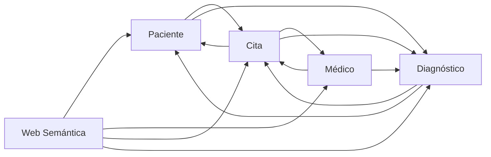

# Documentación General Técnica — NOVA Atención Médica

## 1) Resumen del sistema

NOVA es una plataforma de backend basada en microservicios para la gestión de atención médica. Su objetivo es cubrir el ciclo clínico básico:

- administración de pacientes,
- administración de médicos y horarios,
- agenda de citas con reglas de solape,
- registro de diagnósticos,
- consulta semántica del conocimiento clínico.

La solución integra un módulo de Web Semántica que transforma datos operacionales en grafos RDF para consultas SPARQL y consultas en lenguaje natural.

## 2) Arquitectura de alto nivel

### Microservicios y puertos

- `msvc-medico` → `8080`
- `msvc-cita` → `8081`
- `msvc-diagnostico` → `8082`
- `msvc-paciente` → `8083`
- `msvc-web-semantica` → `8084`

### Comunicación entre servicios

- Integración síncrona HTTP con OpenFeign.
- Composición de respuestas para construir vistas agregadas.
- `msvc-web-semantica` consume los cuatro servicios de dominio para generar un grafo integral.

## 3) Tecnologías

- Java 25
- Spring Boot 3.5.9
- Spring Cloud OpenFeign 2025.0.1
- Spring Data JPA
- MySQL y PostgreSQL
- Lombok
- Apache Jena (RDF, inferencia OWL, SPARQL)
- OWL API

## 4) Modelo funcional

### Pacientes

- CRUD de pacientes.
- Historial de citas por integración remota.
- Historial médico por integración con diagnósticos.
- Cambio de estado de cita validando pertenencia de paciente.

### Médicos

- CRUD de médicos.
- Gestión de horarios (`DayOfWeek`, `horaInicio`, `horaFin`).
- Consulta de agenda remota.
- Registro de diagnósticos asociado a cita.

### Citas

- CRUD de citas.
- Consulta por paciente y por médico.
- Construcción de detalle enriquecido (`cita + paciente + médico + diagnósticos`).
- Validación de conflicto horario de médico/paciente para estados activos.

### Diagnósticos

- CRUD de diagnósticos.
- Consulta por cita y por paciente.
- Soft delete mediante campo `activo`.
- Vista con detalle enriquecido (`diagnóstico + cita + paciente`).

### Web Semántica

- Construcción de grafo clínico por cita.
- Construcción de grafo del sistema completo.
- Serialización RDF en Turtle, RDF/XML y JSON-LD.
- Ejecución de consultas SPARQL.
- Traducción básica de preguntas en lenguaje natural a SPARQL.

## 5) Datos y persistencia

### Motores por servicio

- MySQL: `msvc-medico`, `msvc-cita`
- PostgreSQL: `msvc-paciente`, `msvc-diagnostico`, `msvc-web-semantica`

### Configuración de desarrollo actual

- `ddl-auto=create-drop`
- `show-sql=true`
- Credenciales hardcodeadas en `application.properties`

Para entornos no académicos se recomienda:

- usar perfiles por ambiente,
- externalizar credenciales,
- cambiar estrategia DDL a `validate` o `none`.

## 6) Contratos de integración relevantes

- `msvc-cita` consume:
  - `GET /pacientes/{id}`
  - `GET /medicos/{id}`
  - `GET /diagnosticos/cita/{id}`
- `msvc-paciente` consume:
  - `GET /citas/paciente/{id}`
  - `GET /diagnosticos/paciente/{id}`
- `msvc-medico` consume:
  - `GET /citas/medico/{id}`
  - `GET /citas/{id}`
  - `POST /diagnosticos`
- `msvc-diagnostico` consume:
  - `GET /citas/{id}`
  - `GET /pacientes/{id}`
- `msvc-web-semantica` consume:
  - listados de pacientes, médicos, citas y diagnósticos
  - detalle de cita enriquecida

## 7) Casos de uso principales

1. Registrar médico y paciente.
2. Crear cita validando disponibilidad.
3. Consultar detalle agregado de cita.
4. Registrar diagnóstico sobre cita.
5. Consultar grafo RDF de una cita o del sistema.
6. Ejecutar consulta SPARQL o pregunta en lenguaje natural.

## 8) Riesgos técnicos y consideraciones

- La integración síncrona puede propagar latencia entre servicios.
- No hay fallback/circuit breaker implementado.
- Existen `try/catch` silenciosos en agregaciones que pueden ocultar fallos.
- No hay capa de seguridad activa en endpoints.
- `create-drop` elimina datos al reiniciar cada servicio.

## 9) Estructura documental

- `README.md`: visión global operativa.
- `msvc-paciente.md`: detalle técnico del módulo Paciente.
- `msvc-medico.md`: detalle técnico del módulo Médico.
- `msvc-cita.md`: detalle técnico del módulo Cita.
- `msvc-diagnostico.md`: detalle técnico del módulo Diagnóstico.
- `msvc-web-semantica.md`: detalle técnico del módulo semántico.
- `01-Guia-Web-Semantica-Para-Principiantes.md`: guía de uso semántico aplicada al proyecto.
- `glosario.md`: términos y conceptos del dominio.
