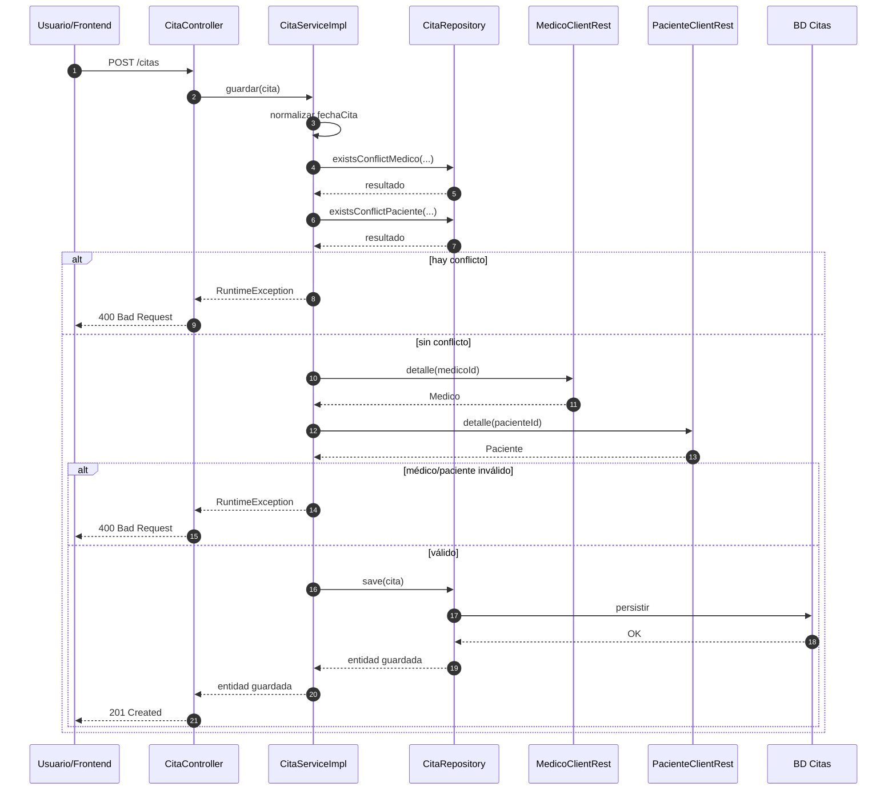
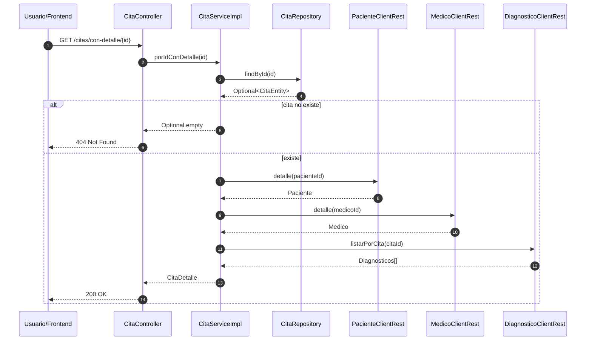
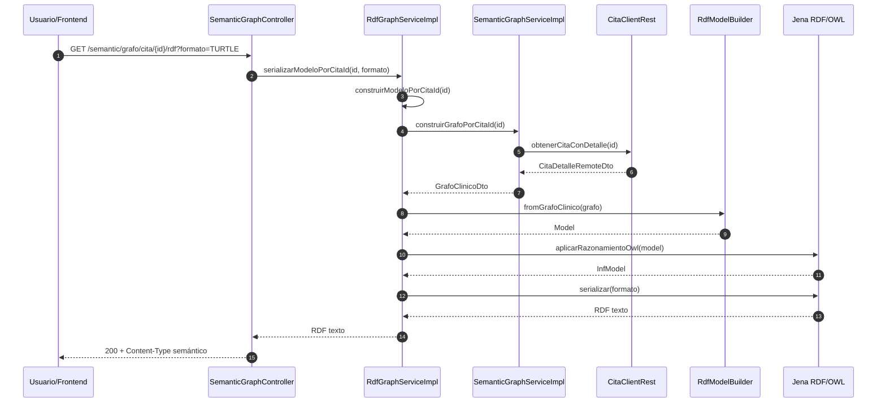
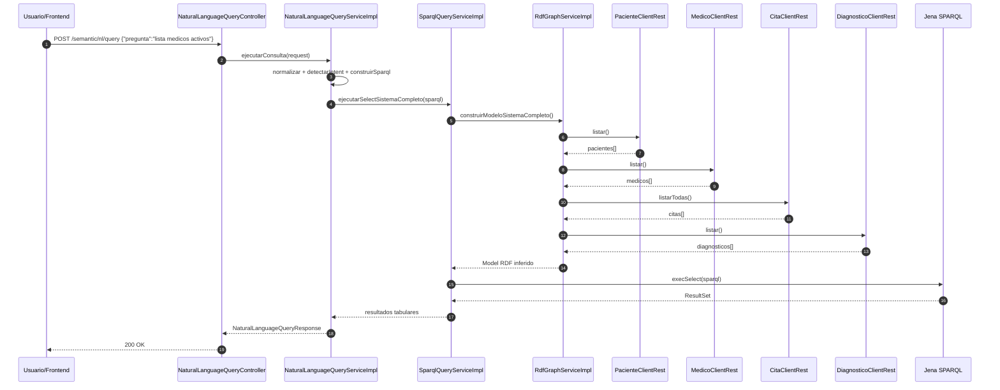

# Casos de Uso y Flujo del Código

## Objetivo

Este documento explica cómo funciona el código del proyecto desde la ejecución real de los controladores y servicios, con foco en casos de uso y secuencias completas.

## Cómo funciona el sistema

- El sistema está dividido en microservicios: `msvc-paciente`, `msvc-medico`, `msvc-cita`, `msvc-diagnostico` y `msvc-web-semantica`.
- El núcleo operativo es `msvc-cita`, porque valida agenda, crea citas y arma detalle clínico.
- `msvc-web-semantica` transforma datos clínicos a RDF y permite consulta por SPARQL o lenguaje natural.

## Caso de uso 1: Crear cita médica

### Flujo funcional

1. El cliente envía `POST /citas`.
2. `CitaController` recibe y delega a `CitaServiceImpl.guardar`.
3. El servicio normaliza fecha.
4. Valida conflictos de horario para médico y paciente.
5. Consulta remoto a `msvc-medico` y `msvc-paciente` para confirmar estado `ACTIVO`.
6. Si todo es válido, guarda en BD y responde `201`.

### Secuencia completa

## Caso de uso 2: Ver cita con detalle clínico

### Flujo funcional

1. El cliente consulta `GET /citas/con-detalle/{id}`.
2. `CitaServiceImpl.porIdConDetalle` obtiene cita local.
3. Enriquecimiento remoto:
   - paciente por `PacienteClientRest`,
   - médico por `MedicoClientRest`,
   - diagnósticos por `DiagnosticoClientRest`.
4. Devuelve un DTO agregado con toda la información disponible.

### Secuencia completa

## Caso de uso 3: Generar RDF por cita

### Flujo funcional

1. El cliente llama `GET /semantic/grafo/cita/{id}/rdf`.
2. `SemanticGraphController` delega a `RdfGraphServiceImpl`.
3. `RdfGraphServiceImpl` pide el grafo clínico a `SemanticGraphServiceImpl`.
4. `SemanticGraphServiceImpl` consume `msvc-cita` con detalle agregado.
5. Se mapea a DTO semántico.
6. Se convierte a modelo RDF (Jena).
7. Se aplica razonamiento OWL.
8. Se serializa en Turtle/RDFXML/JSON-LD.

### Secuencia completa

## Caso de uso 4: Consulta en lenguaje natural

### Flujo funcional

1. El cliente envía pregunta a `POST /semantic/nl/query`.
2. `NaturalLanguageQueryServiceImpl`:
   - normaliza texto,
   - detecta intención,
   - construye SPARQL.
3. Ejecuta SPARQL sobre modelo completo vía `SparqlQueryServiceImpl`.
4. Devuelve respuesta con pregunta, SPARQL generado y resultados.

### Secuencia completa

## Mapa rápido de clases involucradas

- Citas:
  - `CitaController`
  - `CitaServiceImpl`
  - `CitaRepository`
  - `PacienteClientRest`, `MedicoClientRest`, `DiagnosticoClientRest`
- Web semántica:
  - `SemanticGraphController`
  - `NaturalLanguageQueryController`
  - `SemanticGraphServiceImpl`
  - `RdfGraphServiceImpl`
  - `SparqlQueryServiceImpl`
  - `NaturalLanguageQueryServiceImpl`
  - `RdfModelBuilder`
