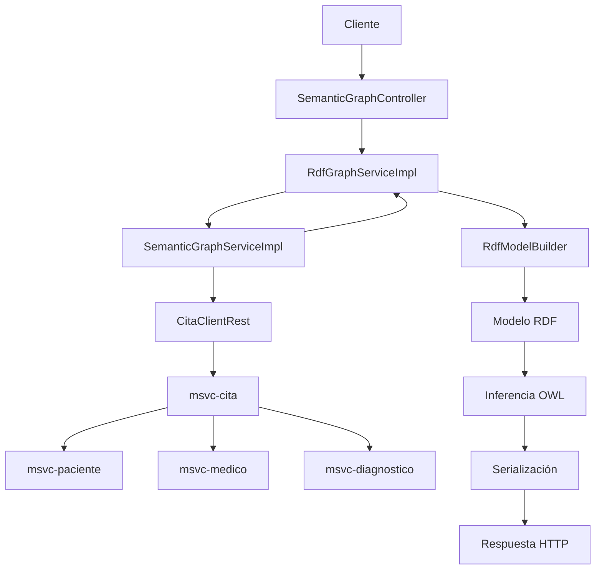
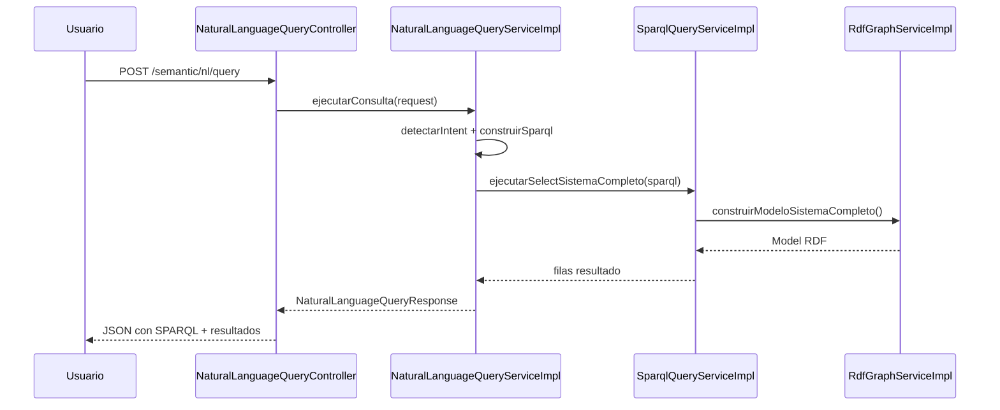
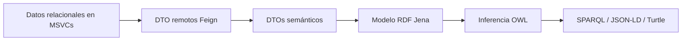

# Web Semántica en NOVA — Guía Paso a Paso para Principiantes

## 1) Introducción conceptual con analogías claras

### ¿Qué es la Web Semántica?

La Web Semántica es una forma de representar información para que no solo sea legible por personas, sino también entendible por máquinas.

En una API tradicional, una respuesta JSON indica datos.  
En Web Semántica, esos datos además tienen significado explícito: qué es cada cosa y cómo se relaciona con otras.

### Analogía 1: Biblioteca sin catálogo vs biblioteca con catálogo inteligente

- **Sin Web Semántica**: tienes miles de libros apilados con etiquetas sueltas.
- **Con Web Semántica**: cada libro tiene una ficha estándar que describe autor, tema, edición y relación con otros libros.

Así, la máquina puede responder preguntas complejas como:  
“¿Qué médicos activos tienen citas programadas con pacientes activos?”

### Analogía 2: Mapa de metro

- Cada entidad del sistema es una **estación** (Paciente, Médico, Cita, Diagnóstico).
- Cada relación es una **línea** (paciente → cita, cita → médico, cita → diagnóstico).

Con ese mapa, puedes encontrar rutas de información sin conocer todos los detalles internos de cada microservicio.

### Conceptos mínimos que necesitas

- **RDF**: modelo de datos en tripletas (sujeto, predicado, objeto).
- **OWL**: reglas semánticas para inferir conocimiento.
- **SPARQL**: lenguaje para consultar grafos RDF.
- **IRI**: identificador único global de recursos.

---

## 2) Estructura del proyecto por carpetas y rol operativo

## 2.1 Estructura raíz del proyecto

```text
Atencion_Medica_msvc_web_semantica_VF.2/
├─ README.md
├─ pom.xml
├─ run-frontend.bat
├─ NOVAingPruebas.json
├─ documentacion/
│  ├─ WebSemantica.md
├─ msvc-paciente/
├─ msvc-medico/
├─ msvc-cita/
├─ msvc-diagnostico/
├─ msvc-web-semantica/
└─ src/ (Main.java de plantilla)
```

### Propósito de cada directorio principal

- **documentacion/**  
  Reúne documentación técnica por módulo y guías globales.

- **msvc-paciente/**  
  Gestión de pacientes y consulta de historial (citas/diagnósticos) vía Feign.

- **msvc-medico/**  
  Gestión de médicos, horarios y operaciones clínicas relacionadas.

- **msvc-cita/**  
  Núcleo de agenda, reglas de solape y consolidación de detalle de cita.

- **msvc-diagnostico/**  
  Gestión de diagnósticos vinculados a citas/pacientes.

- **msvc-web-semantica/**  
  Construcción del grafo semántico, consultas SPARQL y consulta en lenguaje natural.

### ¿Cuándo se usa cada módulo en el flujo?

- En operación clínica normal: paciente, médico, cita y diagnóstico.
- En analítica semántica y consultas de conocimiento: web semántica consume los cuatro módulos anteriores.

---

## 2.2 Estructura interna de `msvc-web-semantica`

```text
msvc-web-semantica/src/main/java/.../semantica/
├─ controllers/
├─ services/
│  └─ implementation/
├─ semantic/
├─ clients/
├─ models/
│  ├─ dto/
│  │  └─ remote/
│  └─ entities/
├─ repositories/
└─ MsvcWebSemanticaApplication.java
```

### `controllers/`

- **SemanticGraphController.java**
  - Expone endpoints para:
    - grafo por cita,
    - RDF por cita,
    - RDF del sistema completo,
    - SPARQL sobre cita o sistema.
  - Se invoca cuando el cliente pide datos semánticos directamente.

- **NaturalLanguageQueryController.java**
  - Recibe preguntas en lenguaje natural (`/semantic/nl/query`).
  - Se usa cuando un usuario no quiere escribir SPARQL manual.

### `services/` y `services/implementation/`

- **SemanticGraphServiceImpl**
  - Construye `GrafoClinicoDto` a partir de datos agregados de una cita.
  - Convierte DTOs remotos a DTOs semánticos con IRIs.

- **RdfGraphServiceImpl**
  - Convierte DTO semántico a `Model` RDF (Jena).
  - Construye modelo de cita o modelo global.
  - Aplica razonamiento OWL.
  - Serializa a Turtle, RDF/XML o JSON-LD.

- **SparqlQueryServiceImpl**
  - Ejecuta consultas SPARQL sobre modelos RDF.
  - Formatea resultados para API REST.

- **NaturalLanguageQueryServiceImpl**
  - Detecta intención en texto.
  - Genera SPARQL según patrones.
  - Ejecuta consulta contra el modelo completo.

### `semantic/`

- **RdfModelBuilder.java**
  - Clase de ensamblaje RDF.
  - Traduce `PacienteSemanticoDto`, `MedicoSemanticoDto`, `CitaSemanticaDto` y `DiagnosticoSemanticoDto` en recursos RDF.
  - Se usa dentro de `RdfGraphServiceImpl`.

### `clients/`

- **PacienteClientRest, MedicoClientRest, CitaClientRest, DiagnosticoClientRest**
  - Conectan con endpoints de otros microservicios.
  - Se usan para recolectar datos que luego se transforman en grafo.

### `models/dto/remote/`

- DTOs espejo de respuestas remotas (`PacienteRemoteDto`, `CitaRemoteDto`, etc.).
- Se utilizan al recibir datos de otros MSVC.

### `models/dto/`

- DTOs semánticos y de respuesta:
  - `GrafoClinicoDto`,
  - `NaturalLanguageQueryRequest/Response`,
  - entidades semánticas de intercambio.

### `models/entities/` y `repositories/`

- Incluyen entidades semánticas persistibles y repositorio de metadatos (`OntologyMetadataRepository`).
- Son base para crecimiento futuro (versionado/metadata ontológica).

---

## 3) Flujo de ejecución completo con clases invocadas

## Caso A: Solicitud de grafo RDF por cita

Endpoint: `GET /semantic/grafo/cita/{id}/rdf?formato=TURTLE`

### Paso a paso

1. **Cliente HTTP** envía la petición.
2. `SemanticGraphController.obtenerGrafoRdfPorCita(...)` recibe `id` y `formato`.
3. Invoca `RdfGraphService.serializarModeloPorCitaId(id, formato)`.
4. `RdfGraphServiceImpl.serializarModeloPorCitaId(...)` llama a `construirModeloPorCitaId(...)`.
5. `RdfGraphServiceImpl.construirModeloPorCitaId(...)` invoca:
   - `SemanticGraphService.construirGrafoPorCitaId(id)`.
6. `SemanticGraphServiceImpl.construirGrafoPorCitaId(...)`:
   - llama a `CitaClientRest.obtenerCitaConDetalle(id)`,
   - mapea remoto → DTO semántico.
7. Regresa `GrafoClinicoDto`.
8. `RdfGraphServiceImpl` usa `RdfModelBuilder.fromGrafoClinico(...)` para producir `Model` RDF.
9. `RdfGraphServiceImpl.aplicarRazonamientoOwl(...)` infiere relaciones/clases.
10. `RdfGraphServiceImpl.serializar(...)` genera texto RDF en formato solicitado.
11. `SemanticGraphController` responde con `Content-Type` correcto.

### Transformación de datos

```text
JSON remoto (msvc-cita con detalle)
→ DTO remoto (CitaDetalleRemoteDto)
→ DTO semántico (GrafoClinicoDto)
→ Modelo RDF (Jena Model)
→ Modelo inferido (InfModel OWL)
→ Texto RDF (Turtle/RDFXML/JSONLD)
```

## Caso B: Consulta en lenguaje natural

Endpoint: `POST /semantic/nl/query`

1. Cliente envía `{ "pregunta": "lista medicos activos" }`.
2. `NaturalLanguageQueryController.ejecutarConsulta(...)`.
3. `NaturalLanguageQueryServiceImpl.ejecutarConsulta(...)`.
4. Normaliza texto y detecta intención (`detectarIntent`).
5. Construye SPARQL (`construirSparqlDesdePregunta`).
6. Ejecuta en `SparqlQueryService.ejecutarSelectSistemaCompleto(...)`.
7. `SparqlQueryServiceImpl` genera modelo global con `RdfGraphService`.
8. Ejecuta query Jena y retorna filas.
9. Respuesta final incluye:
   - pregunta original,
   - SPARQL generado,
   - resultados.

---

## 4) Casos de uso reales con ejemplos de código

## Caso 1: Exportar conocimiento clínico para integración externa

```bash
curl "http://localhost:8084/semantic/grafo/sistema/rdf?formato=JSONLD"
```

Uso real: entregar datos clínicos a un consumidor que entiende JSON-LD.

## Caso 2: Consulta SPARQL manual para citas y participantes

```sparql
PREFIX onto: <http://nova.ing/ontology/>
SELECT ?cita ?paciente ?medico
WHERE {
  ?cita a onto:Cita ;
        onto:paciente ?paciente ;
        onto:medico ?medico .
}
```

```bash
curl -X POST "http://localhost:8084/semantic/grafo/sistema/sparql" ^
  -H "Content-Type: text/plain" ^
  --data-binary @consulta.sparql
```

Uso real: tablero analítico de relaciones clínicas.

## Caso 3: Pregunta en lenguaje natural para un usuario funcional

```bash
curl -X POST "http://localhost:8084/semantic/nl/query" ^
  -H "Content-Type: application/json" ^
  -d "{\"pregunta\":\"lista citas del medico 1\"}"
```

Uso real: usuarios sin conocimiento SPARQL obtienen respuestas semánticas.

## Caso 4: Trazar conocimiento de una cita específica

```bash
curl "http://localhost:8084/semantic/grafo/cita/12/rdf?formato=TURTLE"
```

Uso real: auditoría o análisis puntual de un evento clínico.

---

## 5) Glosario simple

- **Tripleta RDF**: una frase de tres partes: “A se relaciona con B”.
- **Grafo**: conjunto de nodos conectados por relaciones.
- **Ontología**: diccionario formal que define conceptos y relaciones.
- **Inferencia**: deducir nueva información a partir de reglas existentes.
- **SPARQL**: SQL de los grafos RDF.
- **IRI**: dirección única de una entidad.
- **JSON-LD**: JSON con significado semántico.
- **Feign Client**: conector HTTP declarativo entre microservicios.
- **DTO**: objeto para transportar datos entre capas o servicios.
- **MSVC**: microservicio con responsabilidad de negocio específica.

---

## 6) Diagramas visuales del proceso

## 6.1 Flujo general end-to-end



## 6.2 Flujo de consulta en lenguaje natural



## 6.3 Flujo de transformación de datos



---

## Resultado esperado tras leer esta guía

Si llegaste hasta aquí, ya puedes:

- identificar dónde se implementa cada parte semántica en el proyecto,
- seguir el flujo exacto de clases desde la petición hasta la respuesta,
- ejecutar consultas semánticas en tres niveles:
  - por endpoint RDF,
  - por SPARQL manual,
  - por lenguaje natural,
- explicar a otro desarrollador cómo NOVA transforma datos clínicos operacionales en conocimiento semántico.
