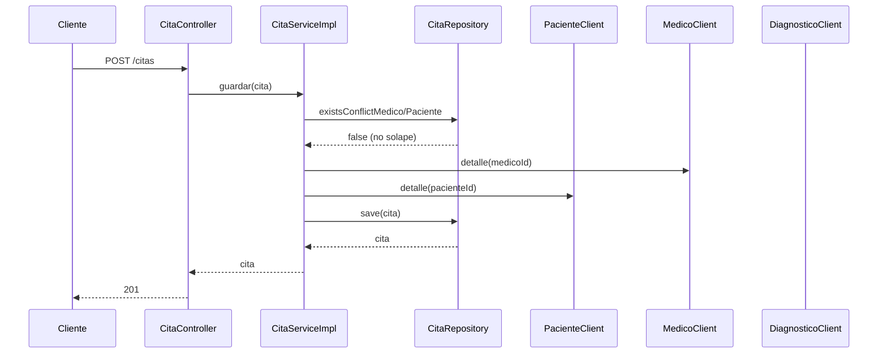
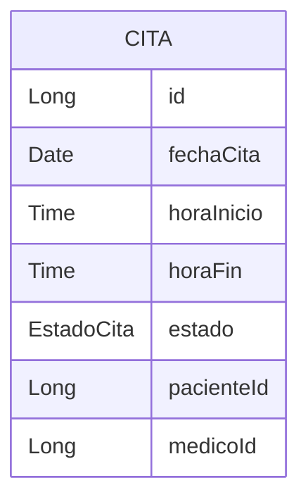
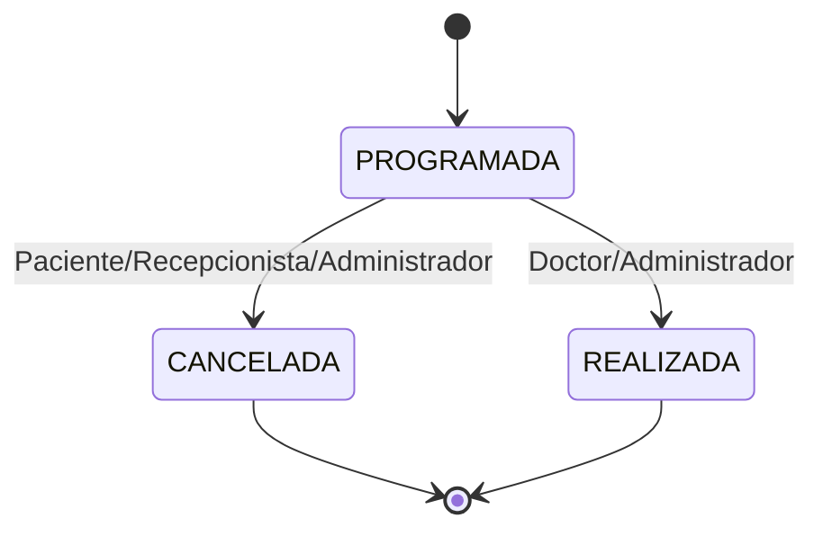
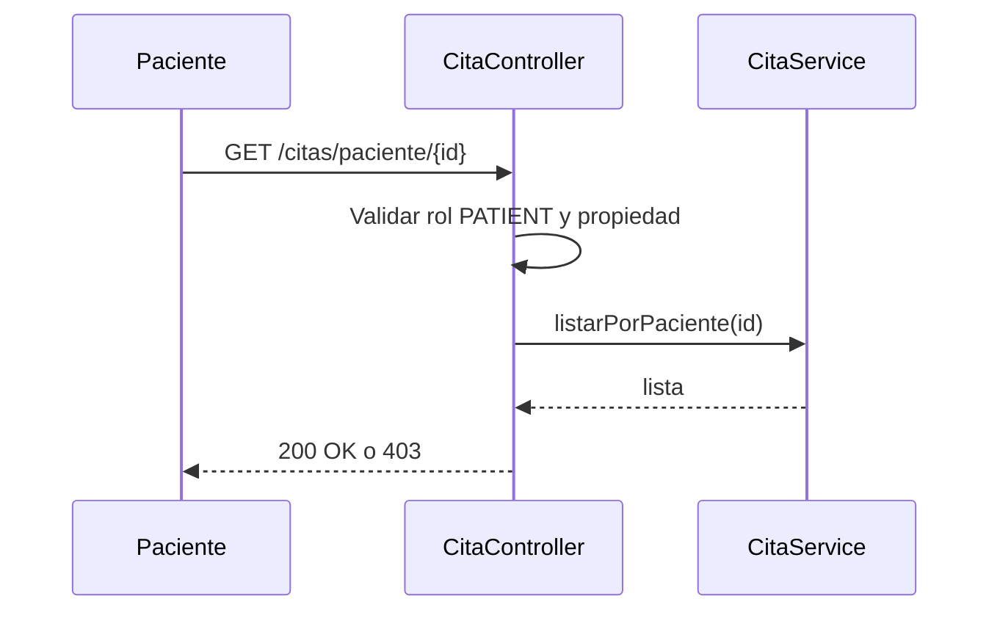
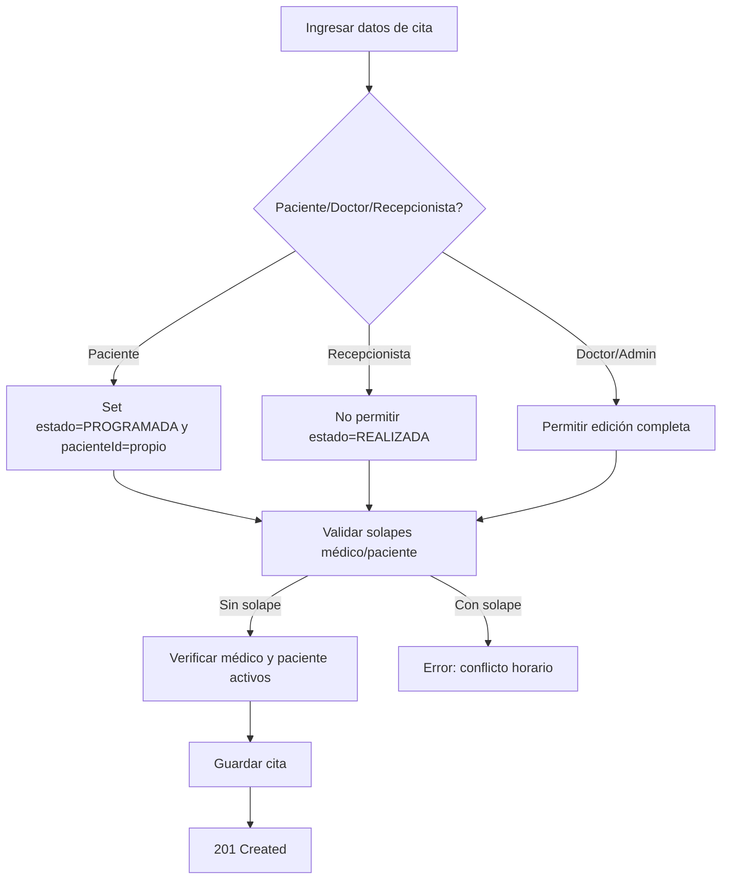
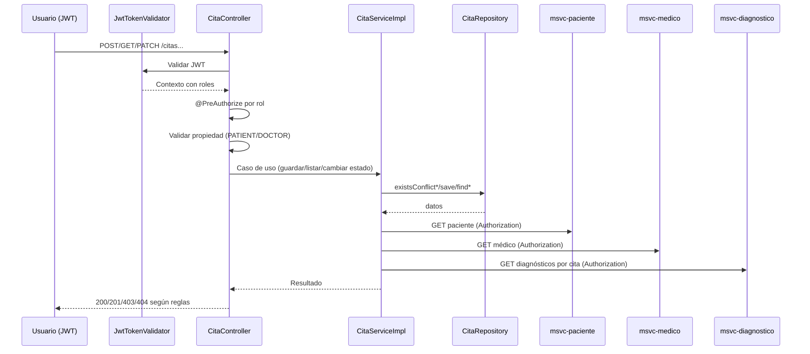

# MSVC Cita — Documentación

> Nota de versión actual: este servicio ya no aplica filtros JWT ni reglas de seguridad en código; cualquier sección que mencione JWT, JwtTokenValidator o @PreAuthorize se considera documentación histórica.

## Propósito
- Gestiona el ciclo de vida de citas médicas: creación, consulta, edición, cancelación y cambio de estado.
- Orquesta datos de paciente y médico, y enlaza diagnósticos asociados.

## Estructura Interna
- Controller: [CitaController](file:///d:/IngSoftware3/NOVA_ing-AtencionMedica_V.5_End/msvc-cita/src/main/java/org/nova/ing/springcloud/atencion/medica/msvc/cita/controllers/CitaController.java)
- Service: [CitaService](file:///d:/IngSoftware3/NOVA_ing-AtencionMedica_V.5_End/msvc-cita/src/main/java/org/nova/ing/springcloud/atencion/medica/msvc/cita/services/CitaService.java), [CitaServiceImpl](file:///d:/IngSoftware3/NOVA_ing-AtencionMedica_V.5_End/msvc-cita/src/main/java/org/nova/ing/springcloud/atencion/medica/msvc/cita/services/implementation/CitaServiceImpl.java)
- Repository: [CitaRepository](file:///d:/IngSoftware3/NOVA_ing-AtencionMedica_V.5_End/msvc-cita/src/main/java/org/nova/ing/springcloud/atencion/medica/msvc/cita/repositories/CitaRepository.java)
- Entidad: [CitaEntity](file:///d:/IngSoftware3/NOVA_ing-AtencionMedica_V.5_End/msvc-cita/src/main/java/org/nova/ing/springcloud/atencion/medica/msvc/cita/models/entities/CitaEntity.java)
- Enums: Estado de cita ([EstadoCita](file:///d:/IngSoftware3/NOVA_ing-AtencionMedica_V.5_End/msvc-cita/src/main/java/org/nova/ing/springcloud/atencion/medica/msvc/cita/enums/EstadoCita.java))
- Seguridad: filtro JWT y utilidades; reglas por @PreAuthorize.
- Feign Clients: [PacienteClientRest](file:///d:/IngSoftware3/NOVA_ing-AtencionMedica_V.5_End/msvc-cita/src/main/java/org/nova/ing/springcloud/atencion/medica/msvc/cita/clients/PacienteClientRest.java), [MedicoClientRest](file:///d:/IngSoftware3/NOVA_ing-AtencionMedica_V.5_End/msvc-cita/src/main/java/org/nova/ing/springcloud/atencion/medica/msvc/cita/clients/MedicoClientRest.java), [DiagnosticoClientRest](file:///d:/IngSoftware3/NOVA_ing-AtencionMedica_V.5_End/msvc-cita/src/main/java/org/nova/ing/springcloud/atencion/medica/msvc/cita/clients/DiagnosticoClientRest.java)
- Feign Interceptor: [FeignInterceptorConfig](file:///d:/IngSoftware3/NOVA_ing-AtencionMedica_V.5_End/msvc-cita/src/main/java/org/nova/ing/springcloud/atencion/medica/msvc/cita/config/FeignInterceptorConfig.java)

## Ciclo de Funcionamiento por Clase
- CitaController:
  - Recibe solicitudes REST; valida rol/propiedad; delega en servicio.
  - Expone listados por paciente/médico y cambio de estado con reglas.
- CitaServiceImpl:
  - Normaliza fecha; valida solapes por repositorio; consulta MSVCs remotos para verificar estado de entidades; guarda/actualiza.
  - Construye detalle con paciente, médico y diagnósticos vía Feign.
- CitaRepository:
  - findByPacienteId / findByMedicoId
  - existsConflictMedico / existsConflictPaciente para evitar solapes activos.
- CitaEntity:
  - Modelo de persistencia con campos obligatorios y estado de negocio.
- JwtTokenValidator/JwtUtils:
  - Valida token y extrae userId; habilita contexto de seguridad para reglas.
- Feign Clients + Interceptor:
  - Propagan Authorization para validar acceso en servicios remotos.

## Flujo de Funcionamiento

## Catálogo de Endpoints
- GET /citas (ADMIN)
- GET /citas/{id}
- GET /citas/con-detalle/{id}
- GET /citas/paciente/{id} (propiedad paciente aplicada)
- GET /citas/medico/{id} (propiedad médico aplicada)
- POST /citas (DOCTOR, ADMIN, PATIENT, RECEPTIONIST con reglas)
- PUT /citas/{id} (DOCTOR, ADMIN)
- DELETE /citas/{id}
- DELETE /citas/{id}/force (ADMIN)
- PATCH /citas/{id}/estado (ADMIN, DOCTOR, PATIENT con reglas)

## Reglas de Validación
- CitaEntity: fechaCita, horaInicio, horaFin, motivo, estado, pacienteId, medicoId obligatorios.
- Solapes: se evita cuando estado no es CANCELADA/REALIZADA y hay intersección de tiempo.
- Estados:
  - Paciente: solo CANCELADA sobre sus citas.
  - Doctor: REALIZADA solo si estaba PROGRAMADA y es su cita.
  - Recepcionista: no puede marcar REALIZADA.

## Diagrama ER

## Diagramas Adicionales
- Diagrama de Estados de Cita

- Secuencia: Listar citas por Paciente con validación de propiedad

- Actividad: Crear cita (reglas y validaciones)

## Migraciones Futuras
- Índices por (medicoId, fechaCita, horaInicio, horaFin) y (pacienteId, fechaCita, horaInicio, horaFin).
- Auditoría y soft delete uniforme.
- Externalizar URLs Feign a properties/perfiles; añadir tolerancia a fallos.

## Buenas Prácticas
- Validar propiedad/rol en controlador; reglas de horario en servicio.
- Mantener consistencia de estados; usar transacciones en cambios de estado.

## Flujo de Seguridad + Funcionamiento
- Entrada con JWT:
  - El filtro JwtTokenValidator valida el token y establece roles en el contexto.
- Autorización:
  - @PreAuthorize en controladores define acceso por rol (ADMIN, DOCTOR, PATIENT, RECEPTIONIST).
  - Propiedad:
    - PATIENT: solo accede a sus citas y solo puede cancelar.
    - DOCTOR: solo gestiona su propia agenda y puede marcar REALIZADA bajo condiciones.
    - RECEPTIONIST: no puede marcar REALIZADA.
- Funcionamiento general:
  - Controlador valida rol/propiedad y delega al servicio.
  - Servicio realiza validación de solapes y verifica estados de paciente/médico vía Feign.
  - Repositorio persiste cambios; las respuestas dependen de las reglas.

