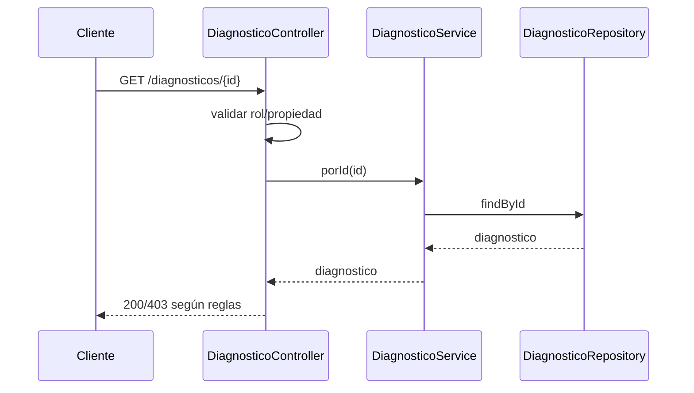
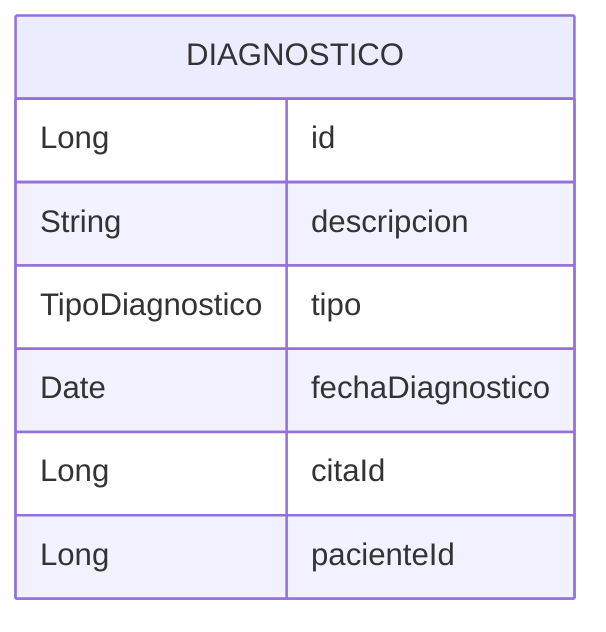
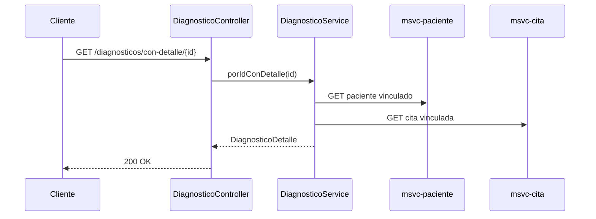
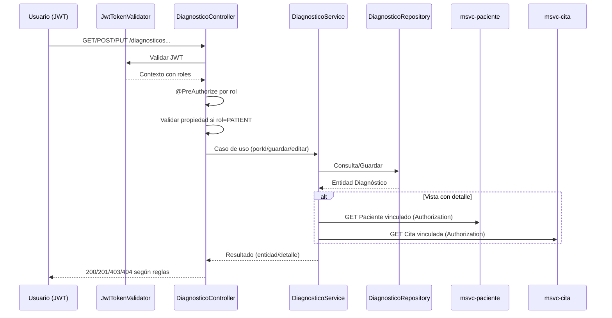

# MSVC Diagnóstico — Documentación

> Nota de versión actual: este servicio ya no valida JWT ni aplica reglas de autorización; cualquier sección que haga referencia a filtros de seguridad o @PreAuthorize es histórica.

## Propósito
- Gestiona diagnósticos médicos asociados a citas y pacientes.
- Controla acceso por rol y propiedad del recurso.

## Estructura Interna
- Controller: [DiagnosticoController](file:///d:/IngSoftware3/NOVA_ing-AtencionMedica_V.5_End/msvc-diagnostico/src/main/java/org/nova/ing/springcloud/atencion/medica/msvc/diagnostico/controllers/DiagnosticoController.java)
- Service: DiagnosticoService (interfaz e implementación)
- Repository: DiagnosticoRepository
- Entidad: [DiagnosticoEntity](file:///d:/IngSoftware3/NOVA_ing-AtencionMedica_V.5_End/msvc-diagnostico/src/main/java/org/nova/ing/springcloud/atencion/medica/msvc/diagnostico/models/entities/DiagnosticoEntity.java)
- Enums: TipoDiagnostico
- Seguridad: validación de JWT y reglas de acceso.

## Ciclo de Funcionamiento por Clase
- DiagnosticoController:
  - Aplica @PreAuthorize y reglas de propiedad; expone vistas con detalle agregado.
- DiagnosticoService:
  - Implementa reglas de creación/edición y obtención de listados por cita/paciente.
- DiagnosticoRepository:
  - Consultas por citaId y pacienteId.
- DiagnosticoEntity:
  - Campos obligatorios: descripción, tipo, fecha, citaId, pacienteId; flag activo.

## Flujo de Funcionamiento

## Catálogo de Endpoints
- GET /diagnosticos (ADMIN)
- GET /diagnosticos/{id} (ADMIN, DOCTOR, PATIENT con propiedad)
- GET /diagnosticos/con-detalle/{id} (ADMIN, DOCTOR, PATIENT)
- GET /diagnosticos/cita/{id} (ADMIN, DOCTOR, PATIENT)
- GET /diagnosticos/paciente/{id} (ADMIN, DOCTOR, PATIENT)
- POST /diagnosticos (ADMIN, DOCTOR)
- PUT /diagnosticos/{id} (ADMIN, DOCTOR)
- DELETE /diagnosticos/{id} (ADMIN)
- DELETE /diagnosticos/{id}/force (ADMIN)

## Reglas de Validación
- Campos obligatorios y tipos; activo por defecto.
- Propiedad: paciente solo accede a diagnósticos propios.

## Diagrama ER

## Diagramas Adicionales
- Secuencia: Detalle con información agregada

## Migraciones Futuras
- Índices por (citaId) y (pacienteId).
- Auditoría y control de versiones de diagnóstico si aplica.

## Buenas Prácticas
- Centralizar validaciones en servicio; aplicar DTOs para respuestas.

## Flujo de Seguridad + Funcionamiento
- Entrada con JWT:
  - El cliente envía Authorization: Bearer <token>.
  - El filtro JwtTokenValidator valida firma y caducidad; el contexto de seguridad queda poblado con roles.
- Autorización:
  - @PreAuthorize en controladores restringe acceso por rol (ADMIN/DOCTOR/PATIENT).
  - Validación de propiedad para PATIENT: se compara el userId del token con el paciente asociado al diagnóstico (vía entidad o detalle agregado).
- Funcionamiento general:
  - Controlador recibe solicitud y valida rol/propiedad.
  - Servicio consulta repositorio para recuperar/crear/editar diagnóstico.
  - Para vistas con detalle, el servicio invoca MSVC Paciente y Cita por Feign.
  - Respuesta compuesta con verificación final de reglas.

