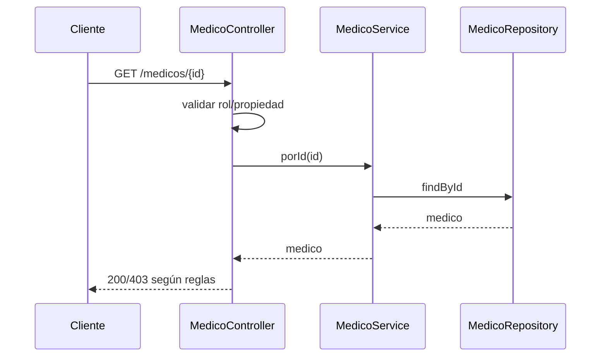
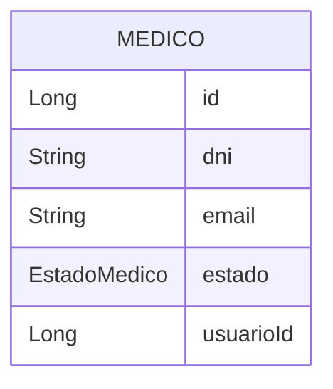
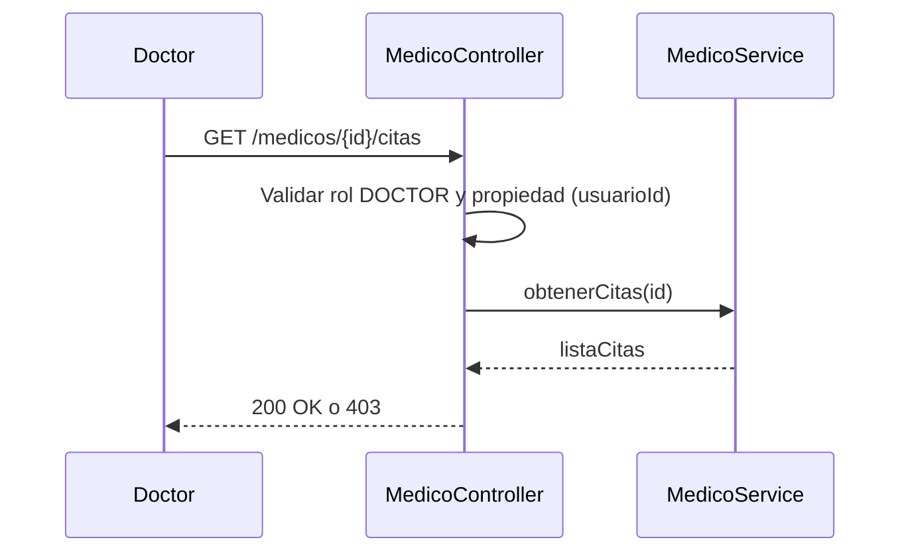
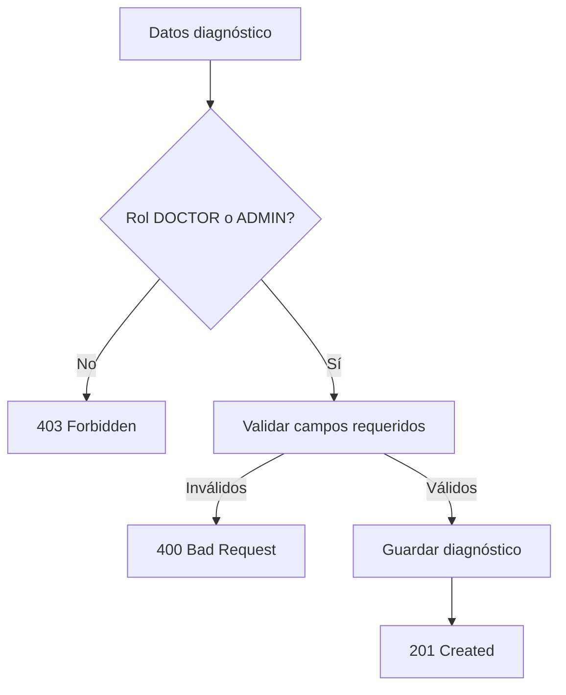
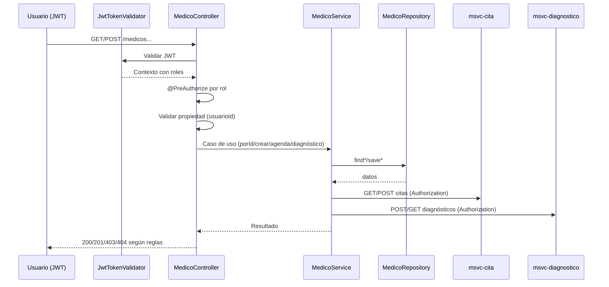

# MSVC Medico — Documentación

> Nota de versión actual: este servicio ya no utiliza JWT ni reglas de seguridad en tiempo de ejecución; las menciones a JwtUtils o @PreAuthorize corresponden a una versión anterior.

## Propósito
- Gestiona el ciclo de vida del médico, su agenda y casos relacionados a citas y diagnósticos.
- Aplica reglas de propiedad: el médico solo consulta/gestiona sus propios recursos, salvo ADMIN.

## Estructura Interna
- Controller: [MedicoController](file:///d:/IngSoftware3/NOVA_ing-AtencionMedica_V.5_End/msvc-medico/src/main/java/org/nova/ing/springcloud/atencion/medica/msvc/medico/controllers/MedicoController.java)
- Service: MedicoService (interfaz e implementación)
- Repository: MedicoRepository
- Entidad: MedicoEntity, HorarioMedico (modelo de apoyo)
- Enums: EstadoMedico, EspecialidadMedico
- Seguridad: validación de propiedad y rol; JwtUtils.
- Feign Clients: hacia Cita y Diagnóstico para operaciones agregadas.

## Ciclo de Funcionamiento por Clase
- MedicoController:
  - Valida acceso por rol/propiedad (usuarioId en JWT).
  - Orquesta creación de médico, agenda de citas y registro de diagnósticos.
- MedicoService:
  - Implementa reglas de negocio para agenda y validaciones de estado.
- MedicoRepository:
  - Consultas por usuarioId y filtros de negocio.
- MedicoEntity:
  - Estado/Especialidad y datos de contacto; asociación lógica con usuario.
- JwtUtils:
  - Decodifica JWT y obtiene userId para validar propiedad.

## Flujo de Funcionamiento

## Catálogo de Endpoints
- GET /medicos (ADMIN, DOCTOR, PATIENT, RECEPTIONIST)
- GET /medicos/{id} (propiedad aplicada para DOCTOR)
- GET /medicos/{id}/citas (propiedad aplicada para DOCTOR)
- POST /medicos (ADMIN)
- PUT /medicos/{id}
- DELETE /medicos/{id}
- DELETE /medicos/{id}/force (ADMIN)
- POST /medicos/agendar-cita (ADMIN, RECEPTIONIST)
- POST /medicos/registrar-diagnostico (DOCTOR, ADMIN)
- GET /medicos/usuario/{usuarioId}

## Reglas de Validación
- Estado de médico debe ser ACTIVO para participar en citas.
- Propiedad: solo el médico dueño puede consultar/modificar su agenda, salvo ADMIN.

## Diagrama ER

## Diagramas Adicionales
- Secuencia: Obtener citas del médico con validación de propiedad

- Actividad: Registrar diagnóstico por médico

## Migraciones Futuras
- Estructurar horarios como entidad normalizada y relacionar con CITA.
- Índices por dni/email; auditoría.

## Buenas Prácticas
- En endpoints agregados (agenda), validar propiedad antes de acceder a datos.
- Minimizar exposición del modelo crudo; usar DTOs donde aplique.

## Flujo de Seguridad + Funcionamiento
- Entrada con JWT:
  - El filtro JwtTokenValidator valida token y roles.
- Autorización:
  - @PreAuthorize restringe por rol (ADMIN, DOCTOR, RECEPTIONIST).
  - Propiedad:
    - DOCTOR: solo accede a su propio perfil y agenda, validando usuarioId.
- Funcionamiento general:
  - Controlador valida rol/propiedad; el servicio ejecuta casos de uso (crear médico, agendar cita, registrar diagnóstico).
  - Repositorio accede a datos; para operaciones agregadas se consume Cita/Diagnóstico vía Feign.

