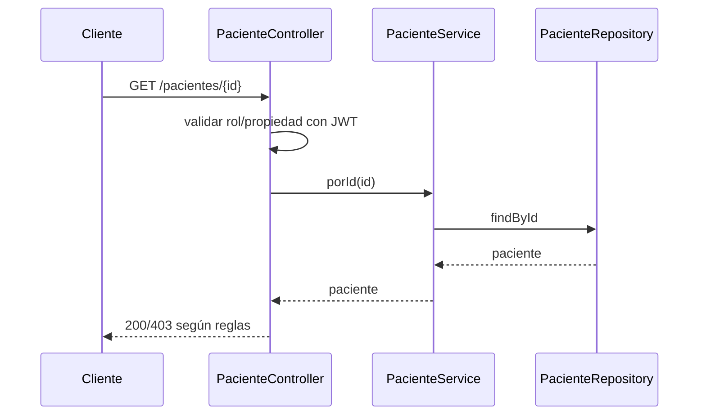
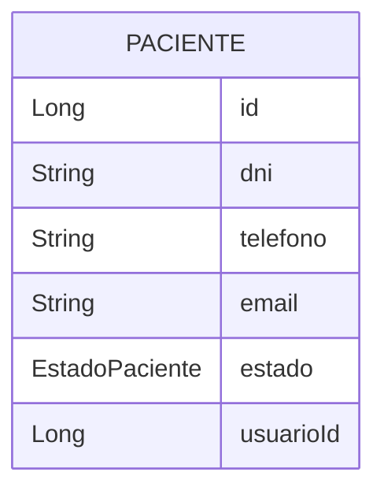
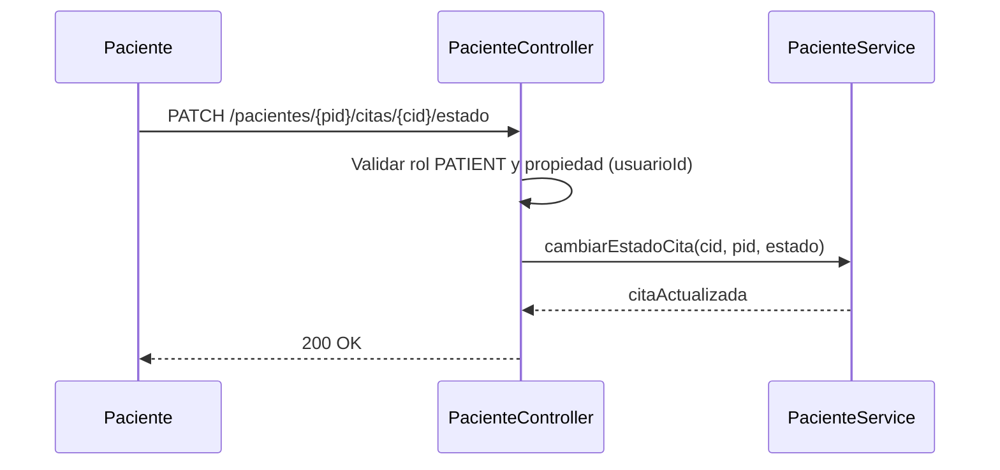
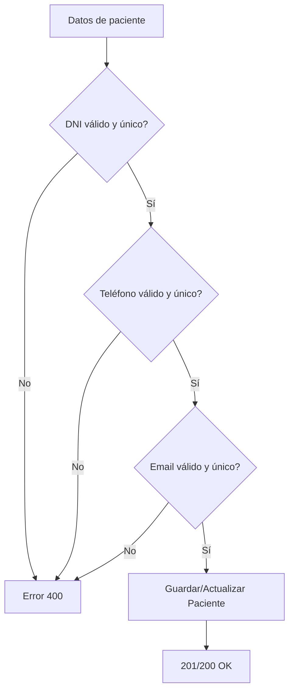
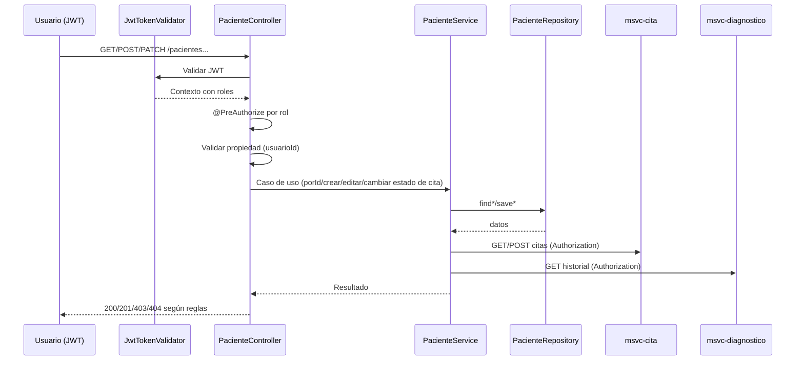

# MSVC Paciente — Documentación

> Nota de versión actual: este servicio ya no utiliza JWT ni validación de roles en código; las referencias a JwtUtils, filtros de seguridad o @PreAuthorize son históricas.

## Propósito
- Gestiona el ciclo de vida del paciente y expone consultas relacionadas (citas, historial médico).
- Aplica validaciones de formato y unicidad sobre datos sensibles.

## Estructura Interna
- Controller: [PacienteController](file:///d:/IngSoftware3/NOVA_ing-AtencionMedica_V.5_End/msvc-paciente/src/main/java/org/nova/ing/springcloud/atencion/medica/msvc/paciente/controllers/PacienteController.java)
- Service: PacienteService (interfaz e implementación, ver paquete services)
- Repository: PacienteRepository (consultas de dominio)
- Entidad: [PacienteEntity](file:///d:/IngSoftware3/NOVA_ing-AtencionMedica_V.5_End/msvc-paciente/src/main/java/org/nova/ing/springcloud/atencion/medica/msvc/paciente/models/entities/PacienteEntity.java)
- Enums: EstadoPaciente, GeneroPaciente
- Seguridad: reglas por rol en controladores; JwtUtils para extraer userId del token.
- Feign Clients: hacia MSVC Cita y Diagnóstico para agregados.

## Ciclo de Funcionamiento por Clase
- PacienteController:
  - Restringe lectura por rol/propiedad (paciente solo accede a su perfil).
  - Delegaciones a servicio para crear/editar/eliminar y obtener citas/historial.
- PacienteService:
  - Reglas de negocio y llamadas a MSVCs remotos para componer vistas (citas, historial).
- PacienteRepository:
  - Consultas por usuarioId y filtros de negocio.
- PacienteEntity:
  - Validaciones de formato: DNI, teléfono, email; unicidad; campos obligatorios.
- JwtUtils:
  - Obtiene userId del token para comprobar propiedad de recursos.

## Flujo de Funcionamiento

## Catálogo de Endpoints
- GET /pacientes (ADMIN, RECEPTIONIST)
- GET /pacientes/{id} (propiedad aplicada para PATIENT)
- GET /pacientes/usuario/{usuarioId}
- GET /pacientes/{id}/citas (propiedad aplicada para PATIENT)
- POST /pacientes (ADMIN)
- PUT /pacientes/{id}
- DELETE /pacientes/{id}
- DELETE /pacientes/{id}/force (ADMIN)
- POST /pacientes/agendar-cita (PATIENT, ADMIN)
- PATCH /pacientes/{pacienteId}/citas/{citaId}/estado (PATIENT propietario)
- GET /pacientes/{id}/historial-medico

## Reglas de Validación
- DNI: patrón ^[1-9][0-9]{7}$ y único.
- Teléfono: patrón ^9[0-9]{8}$ y único.
- Email: formato Email y único.
- Campos obligatorios para nombres, apellidos, dirección, fecha de nacimiento, género y estado.

## Diagrama ER

## Diagramas Adicionales
- Secuencia: Cambiar estado de cita por paciente propietario

- Flujo: Validaciones de datos de Paciente

## Migraciones Futuras
- Índices por dni, telefono, email.
- Auditoría y trazabilidad de cambios (who/when).
- Separar datos sensibles y cifrado en repositorio si aplica.

## Buenas Prácticas
- Validar propiedad estrictamente en controladores.
- Reutilizar DTOs para respuestas públicas evitando exponer todo el modelo.

## Flujo de Seguridad + Funcionamiento
- Entrada con JWT:
  - El filtro JwtTokenValidator valida token y roles en el contexto.
- Autorización:
  - @PreAuthorize aplica restricciones (ADMIN, RECEPTIONIST, PATIENT).
  - Propiedad:
    - PATIENT: solo accede a su perfil y recursos asociados (citas/historial), validando usuarioId.
- Funcionamiento general:
  - Controlador valida rol/propiedad y delega al servicio.
  - Servicio consulta el repositorio y compone vistas; para citas/historial puede invocar Feign a Cita/Diagnóstico.

