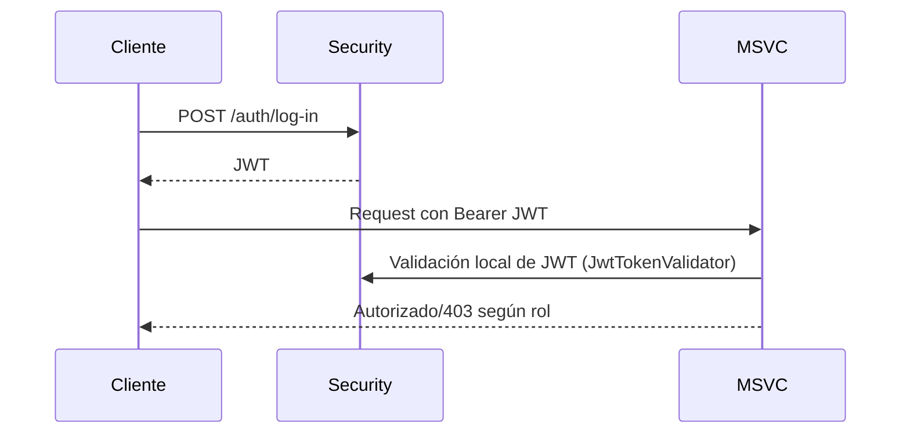
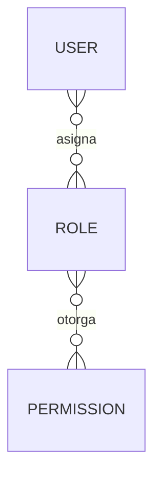
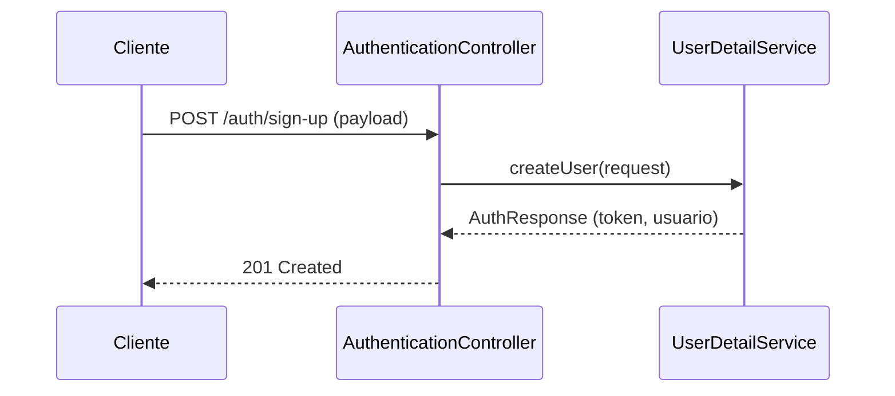
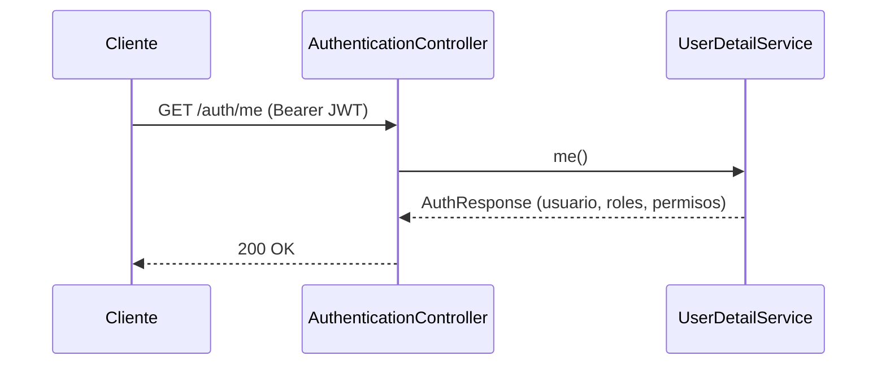
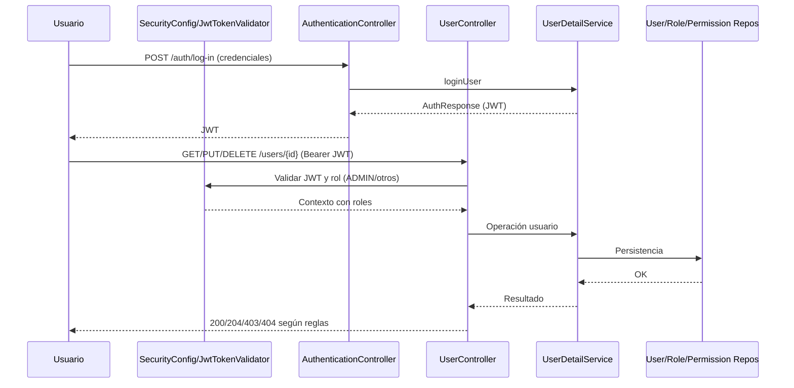

# MSVC Security — Documentación

## Propósito
- Autenticación y gestión de usuarios, roles y permisos.
- Emite y valida JWT; habilita autorización por roles en MSVCs del dominio.

## Estructura Interna
- Controllers: [AuthenticationController](file:///d:/IngSoftware3/NOVA_ing-AtencionMedica_V.5_End/msvc-security/src/main/java/org/nova/ing/springcloud/atencion/medica/msvc/seciruty/controllers/AuthenticationController.java), [UserController](file:///d:/IngSoftware3/NOVA_ing-AtencionMedica_V.5_End/msvc-security/src/main/java/org/nova/ing/springcloud/atencion/medica/msvc/seciruty/controllers/UserController.java)
- SecurityConfig: [SecurityConfig](file:///d:/IngSoftware3/NOVA_ing-AtencionMedica_V.5_End/msvc-security/src/main/java/org/nova/ing/springcloud/atencion/medica/msvc/seciruty/config/SecurityConfig.java)
- Service: UserDetailServiceImpl
- Entidades: [UserEntity](file:///d:/IngSoftware3/NOVA_ing-AtencionMedica_V.5_End/msvc-security/src/main/java/org/nova/ing/springcloud/atencion/medica/msvc/seciruty/models/entities/UserEntity.java), [RoleEntity](file:///d:/IngSoftware3/NOVA_ing-AtencionMedica_V.5_End/msvc-security/src/main/java/org/nova/ing/springcloud/atencion/medica/msvc/seciruty/models/entities/RoleEntity.java), [PermissionEntity](file:///d:/IngSoftware3/NOVA_ing-AtencionMedica_V.5_End/msvc-security/src/main/java/org/nova/ing/springcloud/atencion/medica/msvc/seciruty/models/entities/PermissionEntity.java)
- Enums: [RoleEnum](file:///d:/IngSoftware3/NOVA_ing-AtencionMedica_V.5_End/msvc-security/src/main/java/org/nova/ing/springcloud/atencion/medica/msvc/seciruty/enums/RoleEnum.java)
- Filtro: JwtTokenValidator; Utils: JwtUtils

## Ciclo de Funcionamiento por Clase
- AuthenticationController:
  - Registro/login; retorna AuthResponse con token y metadatos.
- UserController:
  - CRUD de usuarios; delete permanente solo ADMIN.
- SecurityConfig:
  - Stateless; reglas de autorización por rutas; inserta JwtTokenValidator.
- UserDetailServiceImpl:
  - Lógica de creación/login; armado del JWT con claim userId.
- Entidades:
  - UserEntity: atributos de cuenta; roles M:N.
  - RoleEntity: nombre y permisos M:N.
  - PermissionEntity: nombre único.

## Flujo de Autorización

## Catálogo de Endpoints
- POST /auth/sign-up
- POST /auth/log-in
- GET /auth/me
- GET /users
- GET /users/{id}
- PUT /users/{id}
- DELETE /users/{id}
- DELETE /users/{id}/force (ADMIN)

## Diagrama ER

## Diagramas Adicionales
- Secuencia: Sign-up y asignación de rol

- Secuencia: Me (perfil autenticado)

## Migraciones Futuras
- Revocar tokens y listas de bloqueo si se requiere.
- Password policies; MFA opcional; auditoría de accesos.

## Buenas Prácticas
- No exponer contraseñas; almacenar con BCrypt.
- Restringir rutas por método y rol; minimizar superficie pública.

## Flujo de Seguridad + Funcionamiento (Auth y Users)
- Entrada con JWT (según ruta):
  - /auth/sign-up y /auth/log-in: públicas para POST; el resto requiere JWT.
  - SecurityConfig agrega JwtTokenValidator y define reglas por ruta/método/rol.
- Autorización:
  - /users/**: requiere ADMIN para operaciones sensibles (delete permanente), y roles definidos para lectura/edición.
- Funcionamiento general:
  - Controladores reciben la solicitud; Auth usa UserDetailService para crear/login y construir el JWT (con userId).
  - Users gestiona CRUD de usuarios y roles; repositorios persisten cambios.

