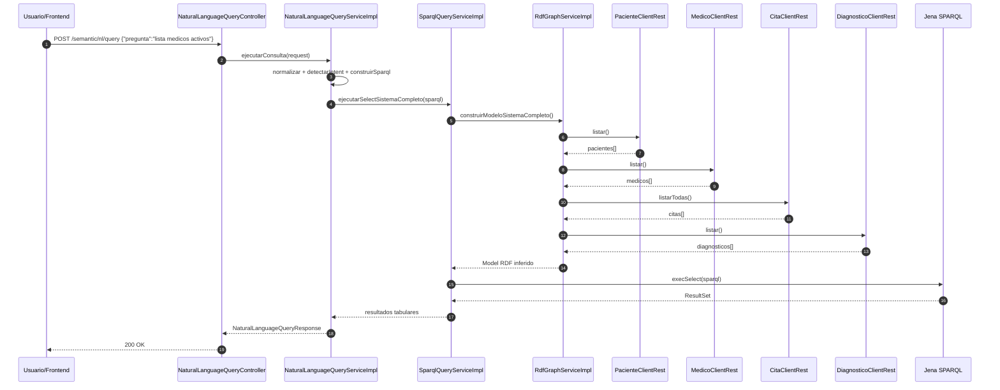

# Consulta en lenguaje natural

Este flujo permite consultar el sistema semántico sin escribir SPARQL manualmente.

### Secuencia funcional



### El cliente envía `POST /semantic/nl/query`



### `NaturalLanguageQueryServiceImpl` procesa la pregunta

Normaliza el texto, detecta la intención y construye SPARQL.



### `SparqlQueryServiceImpl` ejecuta la consulta

La consulta se corre sobre el modelo del sistema completo.



### Se devuelve la respuesta final

Incluye la pregunta original, el SPARQL generado y los resultados.



### Secuencia técnica

### Alcance actual

* El procesamiento es rule-based.
* La traducción depende de patrones y vocabulario implementados.
* No usa modelos LLM.
