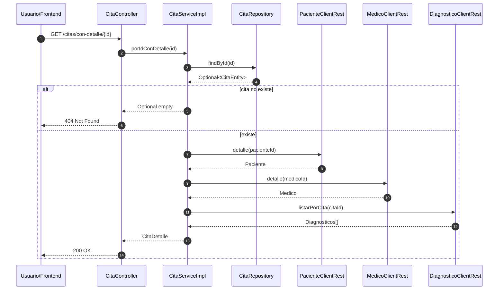

# Consultar una cita con detalle

Este flujo explica cómo `msvc-cita` arma una vista clínica enriquecida a partir de varias fuentes.

### Secuencia funcional



### El cliente consulta `GET /citas/con-detalle/{id}`



### `CitaServiceImpl.porIdConDetalle` busca la cita local



### El servicio enriquece la respuesta

Consulta paciente, médico y diagnósticos mediante clientes remotos.



### Devuelve un DTO agregado

La respuesta incluye toda la información disponible para la cita.



### Secuencia técnica

### Resultado esperado

La respuesta reúne:

* la cita,
* el paciente,
* el médico,
* los diagnósticos asociados.

### Por qué importa

Esta vista es la base para frontends clínicos y para la construcción del grafo semántico.
