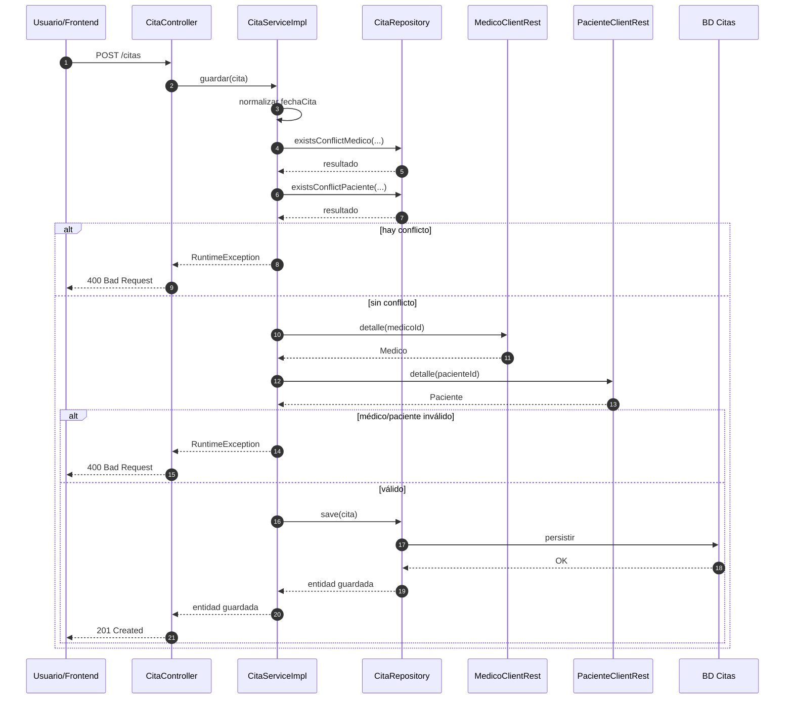

# Crear una cita

Este flujo describe cómo el sistema crea una cita y valida disponibilidad antes de persistirla.

### Secuencia funcional



### El cliente envía `POST /citas`

La petición entra por `CitaController`.



### `CitaController` delega a `CitaServiceImpl.guardar`

La lógica de negocio ocurre en el servicio.



### El servicio normaliza la fecha

`fechaCita` se normaliza para evitar inconsistencias por tiempo.



### Valida conflictos de horario

Se verifica conflicto por médico y por paciente.



### Consulta médico y paciente

Se valida existencia y estado `ACTIVO` en ambos servicios remotos.



### Guarda la cita

Si no hay conflicto y las entidades son válidas, la cita se persiste.



### Secuencia técnica

### Qué protege este flujo

* evita solapes,
* evita citas con entidades inactivas,
* asegura una agenda consistente.
