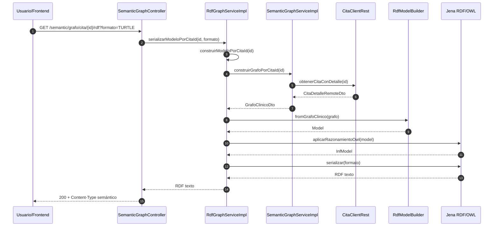

# Generar RDF por cita

Este flujo transforma una cita enriquecida en un modelo RDF serializable.

### Secuencia funcional



### El cliente llama `GET /semantic/grafo/cita/{id}/rdf`



### `SemanticGraphController` delega a `RdfGraphServiceImpl`



### `SemanticGraphServiceImpl` obtiene la cita con detalle

La fuente remota es `msvc-cita`.



### El dato agregado se mapea a DTO semántico



### `RdfModelBuilder` construye el modelo RDF



### Se aplica razonamiento OWL



### El modelo se serializa

Los formatos soportados son `TURTLE`, `RDFXML` y `JSONLD`.



### Secuencia técnica



### Transformación de datos

```
JSON remoto
→ DTO remoto
→ DTO semántico
→ Modelo RDF
→ Modelo inferido
→ Texto RDF
```
