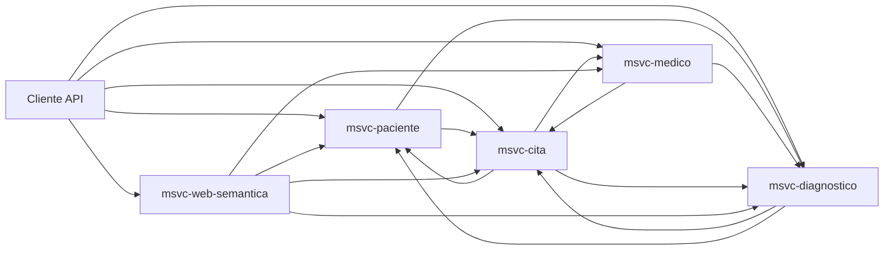

# README

Sistema distribuido para la gestión de atención médica con cinco microservicios de dominio y una capa semántica basada en RDF/OWL/SPARQL.

## Descripción del proyecto

El proyecto implementa un backend por dominios para:

* Gestión de pacientes.
* Gestión de médicos y horarios.
* Gestión de citas con validación de solapes.
* Gestión de diagnósticos asociados a cita y paciente.
* Exposición semántica de datos clínicos y consultas SPARQL.

El enfoque actual es académico/técnico y no incluye autenticación/autorización activa en los controladores.

## Arquitectura

### Microservicios

* **msvc-paciente** (`8083`): CRUD de pacientes, historial clínico y operaciones sobre citas del paciente.
* **msvc-medico** (`8080`): CRUD de médicos, horarios, agenda y registro de diagnósticos.
* **msvc-cita** (`8081`): núcleo de agendamiento, conflictos de horario y detalle agregado de cita.
* **msvc-diagnostico** (`8082`): CRUD de diagnósticos y consultas por cita/paciente.
* **msvc-web-semantica** (`8084`): construcción de grafos semánticos, serialización RDF y ejecución SPARQL.

### Comunicación

* Comunicación síncrona HTTP entre servicios con **Spring Cloud OpenFeign**.
* Agregación de datos por composición de respuestas (por ejemplo, cita + paciente + médico + diagnósticos).
* La capa semántica consume los MSVC operacionales para construir un modelo de conocimiento unificado.

### Diagrama lógico



## Tecnologías utilizadas

* **Java 25**
* **Spring Boot 3.5.9**
* **Spring Cloud 2025.0.1**
* **Spring Data JPA**
* **OpenFeign**
* **Lombok**
* **Apache Jena 5.6.0**
* **OWL API 5.1.20**
* **Motores de datos**:
  * MySQL (msvc-medico, msvc-cita)
  * PostgreSQL (msvc-paciente, msvc-diagnostico, msvc-web-semantica)

## Requisitos de instalación

* JDK 25 disponible en `PATH`.
* Maven Wrapper (incluido en cada MSVC).
* Instancias de base de datos locales:
  * MySQL en `localhost:3306`
  * PostgreSQL en `localhost:5432`
* Esquemas esperados:
  * `msvc_medicos`
  * `msvc_citas`
  * `msvc_pacientes`
  * `msvc_diagnosticos`
  * `msvc_web_semantica`

## Configuración

La configuración actual está en `src/main/resources/application.properties` de cada microservicio:

* Credenciales por defecto:
  * MySQL: `root/admin`
  * PostgreSQL: `postgres/admin`
* Persistencia:
  * `spring.jpa.hibernate.ddl-auto=create-drop`
  * `spring.jpa.show-sql=true`

Para entornos reales, mover credenciales a variables de entorno o secretos y ajustar `ddl-auto`.

## Instrucciones de uso



### Compilación global (raíz)

```bash
mvn clean install
```



### Levantar servicios (una terminal por MSVC)

```bash
cd msvc-medico && mvnw.cmd spring-boot:run
cd msvc-cita && mvnw.cmd spring-boot:run
cd msvc-paciente && mvnw.cmd spring-boot:run
cd msvc-diagnostico && mvnw.cmd spring-boot:run
cd msvc-web-semantica && mvnw.cmd spring-boot:run
```



### Endpoints de referencia

* **Pacientes**: `/pacientes`, `/pacientes/{id}`, `/pacientes/{id}/citas`, `/pacientes/{id}/historial-medico`
* **Médicos**: `/medicos`, `/medicos/{id}`, `/medicos/{id}/citas`, `/medicos/agendar-cita`
* **Citas**: `/citas`, `/citas/{id}`, `/citas/con-detalle/{id}`, `/citas/paciente/{id}`, `/citas/medico/{id}`
* **Diagnósticos**: `/diagnosticos`, `/diagnosticos/{id}`, `/diagnosticos/con-detalle/{id}`, `/diagnosticos/cita/{id}`
* **Web semántica**:
  * `/semantic/grafo/cita/{id}`
  * `/semantic/grafo/cita/{id}/rdf?formato=TURTLE|RDFXML|JSONLD`
  * `/semantic/grafo/sistema/rdf?formato=TURTLE|RDFXML|JSONLD`
  * `/semantic/grafo/sistema/sparql`
  * `/semantic/nl/query`



### Ejemplos rápidos

```bash
curl http://localhost:8081/citas/con-detalle/1
```

```bash
curl "http://localhost:8084/semantic/grafo/sistema/rdf?formato=JSONLD"
```

```bash
curl -X POST http://localhost:8084/semantic/nl/query \
  -H "Content-Type: application/json" \
  -d "{\"pregunta\":\"lista citas del medico 1\"}"
```



## Estructura del código

```
/
├─ pom.xml
├─ README.md
├─ documentacion/
│  ├─ 00-Documentacion-General.md
│  ├─ msvc-paciente.md
│  ├─ msvc-medico.md
│  ├─ msvc-cita.md
│  ├─ msvc-diagnostico.md
│  ├─ msvc-web-semantica.md
│  ├─ 01-Guia-Web-Semantica-Para-Principiantes.md
│  └─ glosario.md
├─ msvc-paciente/
├─ msvc-medico/
├─ msvc-cita/
├─ msvc-diagnostico/
└─ msvc-web-semantica/
```

Patrón dominante por servicio:

* `controllers`: API REST.
* `services`: reglas de negocio.
* `repositories`: acceso JPA.
* `models/entities`: persistencia.
* `models/dto`: contratos de intercambio.
* `clients`: integración Feign con otros MSVC.

## Pruebas y validación

Ejecutar pruebas por módulo:

```bash
mvn test -pl msvc-paciente
mvn test -pl msvc-medico
mvn test -pl msvc-cita
mvn test -pl msvc-diagnostico
mvn test -pl msvc-web-semantica
```

## Guía de contribución



### Crear rama de trabajo

Crear rama de trabajo (`feature/*`, `fix/*`, `docs/*`).



### Implementar cambios

Implementar cambios manteniendo separación por dominio.



### Ejecutar compilación y pruebas

Ejecutar compilación y pruebas del/los módulo(s) afectados.



### Verificar contratos

Verificar contratos HTTP entre servicios involucrados.



### Actualizar documentación

Actualizar documentación técnica en `README.md` y `documentacion/*.md`.



### Criterios de calidad

* Mantener cohesión del dominio por microservicio.
* Evitar acoplamiento por base de datos entre servicios.
* Preferir DTOs para integración remota.
* Mantener consistencia de enums de estado.
* Documentar cualquier endpoint o contrato nuevo.

***

Para el detalle técnico por componente, revisar los archivos de la carpeta `documentacion/`.
