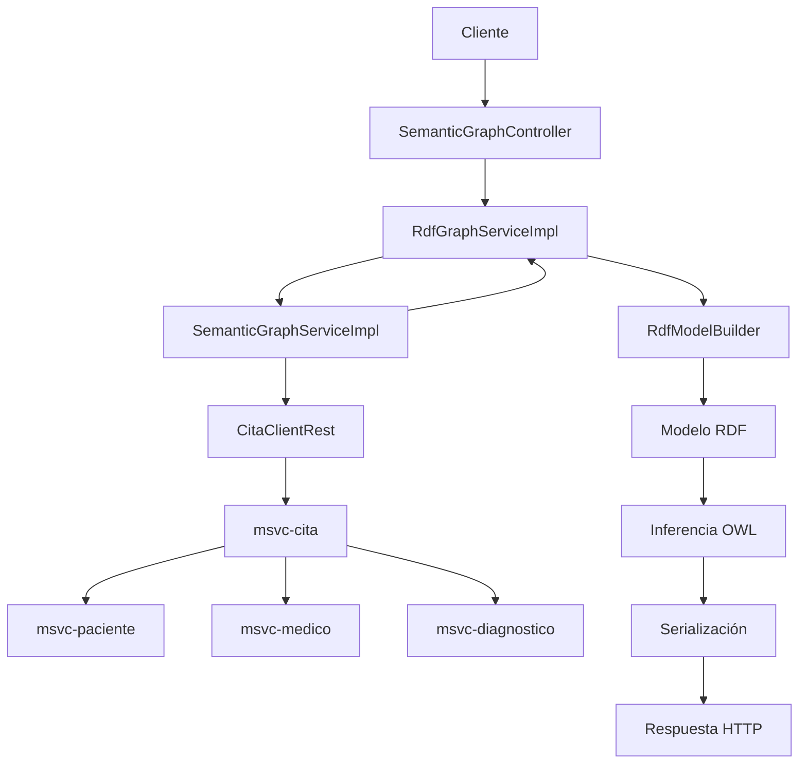
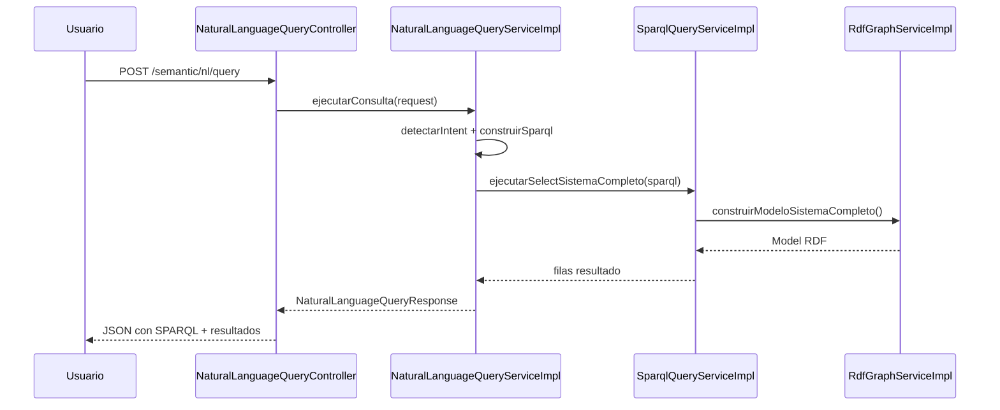
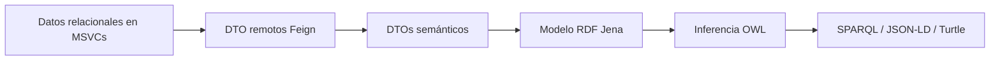

# Diagramas del módulo semántico

### Flujo general end-to-end

```mermaid
flowchart TD
  A[Cliente] --> B[SemanticGraphController]
  B --> C[RdfGraphServiceImpl]
  C --> D[SemanticGraphServiceImpl]
  D --> E[CitaClientRest]
  E --> F[msvc-cita]
  F --> G[msvc-paciente]
  F --> H[msvc-medico]
  F --> I[msvc-diagnostico]
  D --> C
  C --> J[RdfModelBuilder]
  J --> K[Modelo RDF]
  K --> L[Inferencia OWL]
  L --> M[Serialización]
  M --> N[Respuesta HTTP]
```

### Flujo de consulta en lenguaje natural

```mermaid
sequenceDiagram
  participant U as Usuario
  participant C as NaturalLanguageQueryController
  participant N as NaturalLanguageQueryServiceImpl
  participant S as SparqlQueryServiceImpl
  participant R as RdfGraphServiceImpl
  U->>C: POST /semantic/nl/query
  C->>N: ejecutarConsulta(request)
  N->>N: detectarIntent + construirSparql
  N->>S: ejecutarSelectSistemaCompleto(sparql)
  S->>R: construirModeloSistemaCompleto()
  R-->>S: Model RDF
  S-->>N: filas resultado
  N-->>C: NaturalLanguageQueryResponse
  C-->>U: JSON con SPARQL + resultados
```

### Flujo de transformación de datos

```mermaid
flowchart LR
  A[Datos relacionales en MSVCs] --> B[DTO remotos Feign]
  B --> C[DTOs semánticos]
  C --> D[Modelo RDF Jena]
  D --> E[Inferencia OWL]
  E --> F[SPARQL / JSON-LD / Turtle]
```
